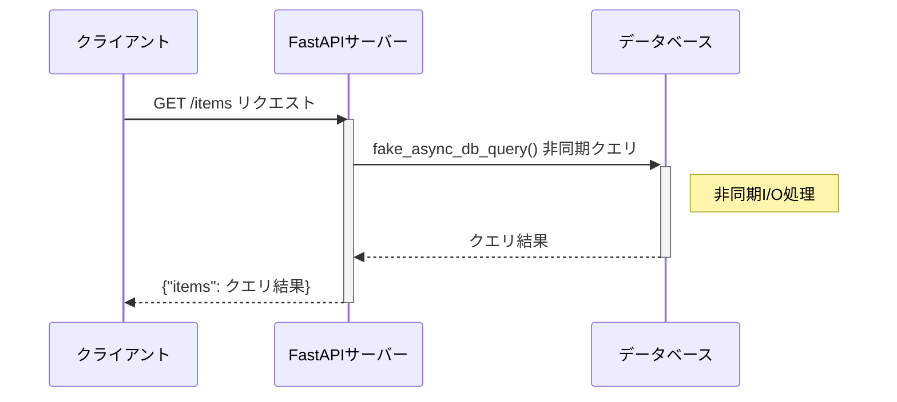
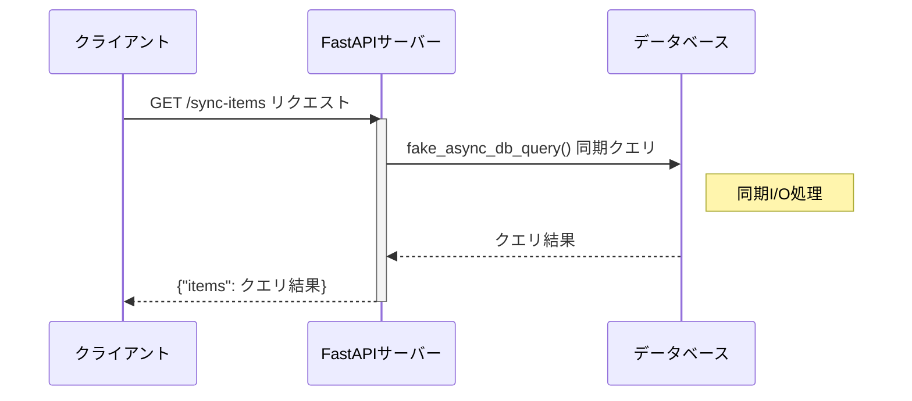

# 高度なFastAPI機能


<div class="pt-12">
  <span @click="$slidev.nav.next" class="px-2 py-1 rounded cursor-pointer" hover="bg-white bg-opacity-10">
    Press Space for next page <carbon:arrow-right class="inline"/>
  </span>
</div>

<div class="abs-br m-6 flex gap-2">
  <button @click="$slidev.nav.openInEditor()" title="Open in Editor" class="text-xl slidev-icon-btn opacity-50 !border-none !hover:text-white">
    <carbon:edit />
  </button>
  <a href="https://github.com/slidevjs/slidev" target="_blank" alt="GitHub" title="Open in GitHub"
    class="text-xl slidev-icon-btn opacity-50 !border-none !hover:text-white">
    <carbon-logo-github />
  </a>
</div>

<!--
The last comment block of each slide will be treated as slide notes. It will be visible and editable in Presenter Mode along with the slide. [Read more in the docs](https://sli.dev/guide/syntax.html#notes)
-->

---

# アジェンダ

- 非同期処理
- 依存性注入
- ミドルウェアの利用

<!--メモ-->

---

# この講義で学ぶこと

- FastAPIの非同期処理
- FastAPIの依存性注入
- FastAPIのミドルウェアの利用

---

# この講義で学ばないこと

- FastAPIの基本的な使い方
- FastAPIの基本的な機能

---

# 非同期処理とは?

## 定義
- 複数のタスクを並行して処理する能力

## メリット
- サーバのレスポンス時間の短縮
- 効率的なリソース利用

## デメリット
- デバッグが難しい
- プログラムの複雑化

---

# FastAPIの非同期処理

FastAPIにおける非同期処理のサンプル  

`async def`を使った非同期エンドポイントの定義
```python
from fastapi import FastAPI

app = FastAPI()

@app.get("/async-items")
async def read_items():
    # 非同期I/O処理
    items = await fake_async_db_query()
    return {"items": items}
```

---

# FastAPIの非同期処理

非同期処理における処理フローシーケンス図  


---

# FastAPIの同期処理

FastAPIにおける同期処理のサンプル  

`def`を使った同期エンドポイントの定義
```python
from fastapi import FastAPI

app = FastAPI()

@app.get("/sync-items")
def read_items():
    # 同期I/O処理
    items = fake_async_db_query()
    return {"items": items}
```

---

# FastAPIの同期処理

同期処理における処理フローシーケンス図  

---

# asyncとawait

どちらもPythonで非同期プログラミングを行うためのキーワード  
- `async`  
  - 非同期関数を定義するためのキーワード
- `await`
  - 非同期関数の実行を待つためのキーワード

-> `async`と`await`を使うことで、非同期処理を行うことができる  
※ asyncで定義した関数は、`await`を使って実行する

---

# デバッグの難しさ

## 同期処理

```python
import time

def task1():
    print("Task 1 before sleep")
    time.sleep(1)  # 1秒待機
    print("Task 1 after sleep")

def task2():
    print("Task 2 before sleep")
    time.sleep(2)  # 2秒待機
    print("Task 2 after sleep")

def main():
    task1()
    task2()

main()
```

---

# デバッグの難しさ

## 非同期処理

```python
import asyncio

async def task1():
    print("Task 1 before await")
    await asyncio.sleep(1)
    print("Task 1 after await")

async def task2():
    print("Task 2 before await")
    await asyncio.sleep(2)
    print("Task 2 after await")

async def main():
    await asyncio.gather(task1(), task2())

asyncio.run(main())
```

<!--非同期はTask1 before, Task2 before, Task1 after, Task2 afterの順番で出力される-->

---

# プログラムが複雑化する

```python
import asyncio

async def fetch_data():
    # 何らかの理由で失敗する非同期処理を想定
    await asyncio.sleep(1)
    raise ValueError("fetch data failed")

async def process_data():
    try:
        data = await fetch_data()
        print(f"Processed data: {data}")
    except ValueError as e:
        print(f"Error: {e}")

async def main():
    await process_data()

asyncio.run(main())
```
<!--fetch_dataが失敗すると、process_dataのtry-exceptで例外処理される-->

---

# プログラムが複雑化する

その他に、以下のような理由で非同期処理はプログラムが複雑化する
- リソースの管理
- デッドロックと競合状態
- コールバックとイベントループ

---
