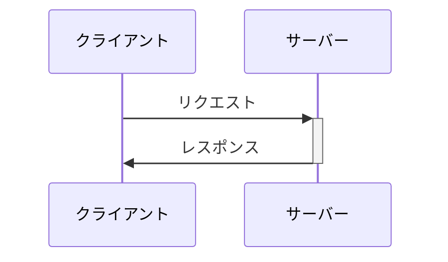
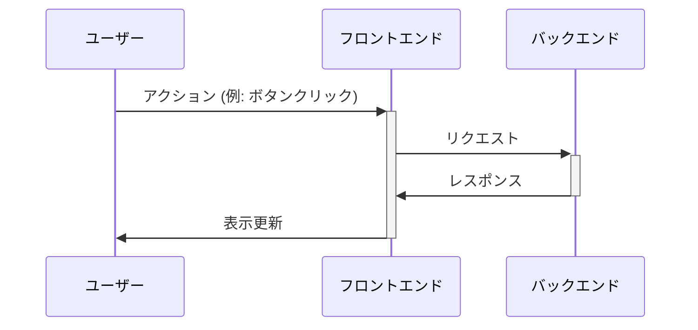
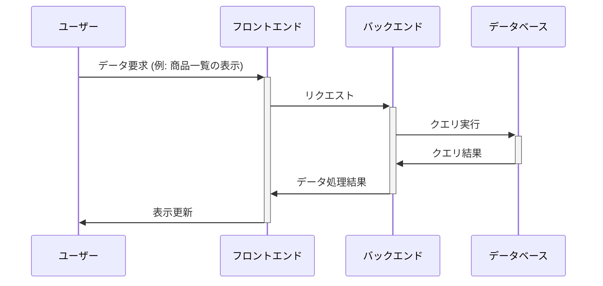

# WebアプリケーションとAPIの基礎

---

## 講義のアジェンダ

1. Webアプリケーションの概要
2. Webアプリケーションのアーキテクチャ
3. APIとは何か？
4. RESTful APIの基礎
5. APIを利用したデータ交換
6. 簡単なAPIのデモと実装
7. Q&A

---

# Webアプリケーションの概要

- Webアプリケーションとは
- Webサイトとの違い
- 一般的なWebアプリケーションの例

---

# Webアプリケーションの概要

Webアプリケーションとは、ウェブブラウザを通じて使用されるアプリケーションである。  
従来のデスクトップアプリケーションとは異なり、インストール不要で、インターネット経由でサービスを利用できる。  
この特性により、利用者は場所やデバイスを問わずにアクセス可能であり、アップデートもサーバー側で行われるため、常に最新の状態を保つことができる。  

---

# Webアプリケーションの特徴

Webアプリケーションの最大の特徴は、その普遍性にある。  
HTML、CSS、JavaScriptなどのウェブ標準技術を用いて開発され、どのようなオペレーティングシステムやデバイスからもアクセス可能である。  
また、クラウド技術の進展により、データの保存や処理をサーバー側で行うことが多くなり、ユーザーは軽量なクライアントデバイスでも高度な処理を享受できるようになった。  
これらの進化により、ビジネスアプリケーションからエンターテインメント、教育ツールまで、幅広い分野でWebアプリケーションが活用されている。  

---

# Webサイトの違い

WebアプリケーションとWebサイトの主な違いは、その目的とユーザーとの対話性にある。  
Webサイトは主に情報提供が目的であり、静的なコンテンツをユーザーに提供することが多い。  
一方、Webアプリケーションはユーザーの入力を受け取り、それに基づいて動的にコンテンツを生成したり、データを処理したりすることが特徴である。  

---

# 一般的なWebアプリケーションの例

企業のホームページやニュースポータルサイトは、ユーザーが情報を閲覧することが主な目的のWebサイトである。  
これに対して、オンラインバンキングやSNS、電子商取引のプラットフォームなどは、  
ユーザーが情報を投稿したり、商品を購入したりといった具体的なアクションを起こせるWebアプリケーションである。  
Webアプリケーションはしばしば、ユーザー認証やデータベースとのやり取りが必要となる複雑な処理を含んでいる。  

---

# Webアプリケーションのアーキテクチャ

- クライアント/サーバーモデル
- フロントエンドとバックエンド
- データベースとの連携

---
layout: two-cols

---

# クライアント/サーバーモデル

クライアント/サーバーモデルは、ネットワークアーキテクチャの一形態である。  
このモデルでは、サービスのリクエストを行うクライアントと、それに応答してサービスを提供するサーバーの2つの主要なコンポーネントが存在する。  
クライアントは、ウェブブラウザやアプリケーションなど、ユーザーが直接操作するインターフェースを提供し、  
サーバーは、Webページのホスティングやデータベースの管理、計算処理など、バックエンドでのデータ処理やストレージの役割を担う。  

::right::

---

# フロントエンドとは

フロントエンドとは、ユーザーが直接対話するウェブアプリケーションの部分である。  
主にウェブブラウザ上で実行され、HTML、CSS、JavaScriptなどの技術を使用して構築される。  
フロントエンドの主な目的は、ユーザーに快適で直感的なインターフェースを提供し、  
ユーザーのアクションに基づいて動的な表示や機能を実現することである。

---

# バックエンドとは

バックエンドとは、フロントエンドの背後で動作するサーバーサイドの部分である。  
データベースとのやり取り、サーバーの設定、アプリケーションのロジック処理などを担当し、  
主にサーバー上で実行されるプログラムやスクリプトを用いて構築される。  
バックエンドの役割は、フロントエンドからのリクエストに対して適切なデータや結果を返すことにあり、  
セキュリティやデータ管理、アプリケーションの核となる処理を担う。

---

# フロントエンドとバックエンドの連携 - フロー

---

# データベースとの連携 - 概要

データベースとの連携は、Webアプリケーションにおいて重要な役割を果たす。  
データベースは、ユーザー情報、商品データ、トランザクション履歴など、  
アプリケーションが利用する様々なデータを格納し、管理するシステムである。  
Webアプリケーションのバックエンドは、このデータベースと連携し、  
データの読み書きや更新を行うことで、ユーザーに必要な情報を提供したり、  
ユーザーからの入力をデータベースに保存したりする。

---

# データベースとの連携 - プロセス

アプリケーションのバックエンドは、SQLやNoSQLといったデータベースクエリ言語を使用して、  
データベースに対する操作を実行する。  
例えば、ユーザーがWebフォームから送信したデータは、バックエンドを通じてデータベースに保存され、  
別のユーザーがその情報を要求した場合には、バックエンドがデータベースから該当のデータを取得し、  
フロントエンドを介してユーザーに表示される。  
このように、データベースとの連携によって、動的なコンテンツの生成やユーザーのアクションに基づく処理が可能になる。

---

# データベースとの連携 - フロー

---

# APIとは何か？

- API（アプリケーションプログラミングインターフェース）の定義
- Web APIの役割
- 公開APIとプライベートAPI

---

# APIとは？

API（Application Programming Interface）は、ソフトウェア間でのインタラクションを可能にする契約のことを指す。  
異なるシステム、アプリケーション、またはデバイス間でデータを交換し、機能を共有するための方法を提供する。  

---

# APIの主な利点

- **再利用性**: 一度開発した機能を、異なるプログラムやアプリケーションで再利用できる。
- **抽象化**: 複雑な内部処理を隠し、シンプルなインターフェースを提供する。
- **連携性**: 異なるプラットフォームや言語で書かれたアプリケーション間で容易に連携できる。

---

# APIの種類

- **ウェブAPI**: HTTPプロトコルを使用してウェブサービス間で通信を行う。RESTful APIが一般的な例。
- **ライブラリAPI**: 特定の言語やソフトウェアライブラリで提供される、プログラム構築のための関数やクラスなどの集合。
- **オペレーティングシステムAPI**: OSの機能にアクセスするためのAPI。ファイル操作やウィンドウ管理など、システムレベルの操作を可能にする。

---

# RESTful APIとは

RESTful APIは、ウェブAPIの一種で、RESTアーキテクチャの原則に基づいて設計される。  
リソースの概念に基づくシンプルで標準化されたインターフェースを提供し、HTTPメソッド（GET, POST, PUT, DELETE）を利用してリソースの操作を行う。

---

# なぜAPIが重要なのか？

APIは、モダンなソフトウェア開発において不可欠な役割を果たす。  
マイクロサービスアーキテクチャ、クラウドコンピューティング、モバイルアプリケーション、IoTデバイスなど、様々な分野でAPIが活用されている。  
APIにより、開発の効率化、サービスの連携、イノベーションの促進が実現される。  

---

# RESTful APIの基礎

- RESTの原則
- HTTPメソッド（GET, POST, PUT, DELETE）
- URI設計のベストプラクティス

---

# APIを利用したデータ交換

- JSONとXML
- リクエストとレスポンスの構造
- ステータスコードとエラーハンドリング

---

# FastAPIによる簡単なAPIのデモと実装

- FastAPIの紹介
- 基本的なAPIの構築ステップ
- FastAPIを使用したデモの実装
- 開発者のためのツール（例: Swagger UI）

---

# Q&A

- 質疑応答のセッション

