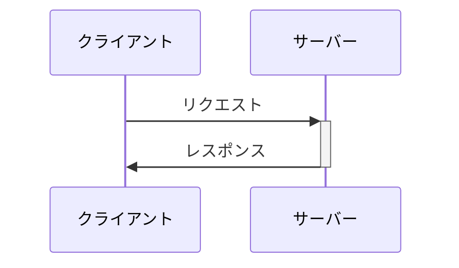
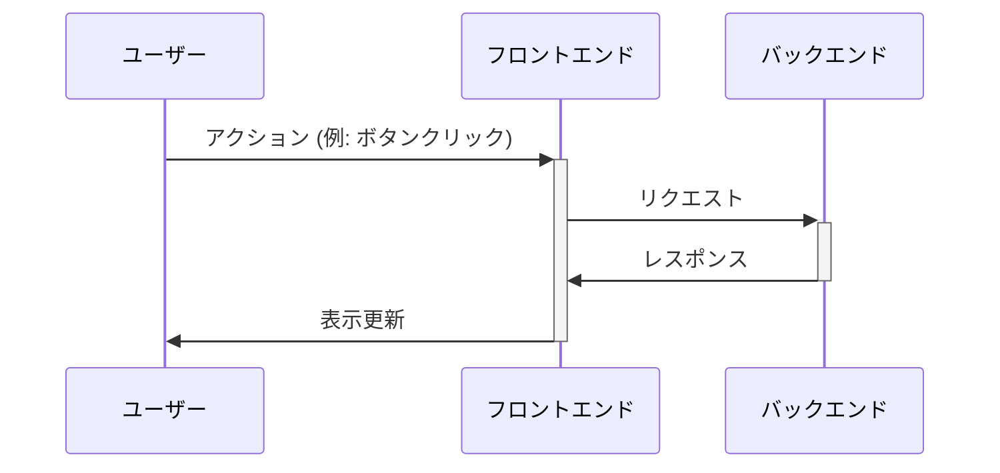
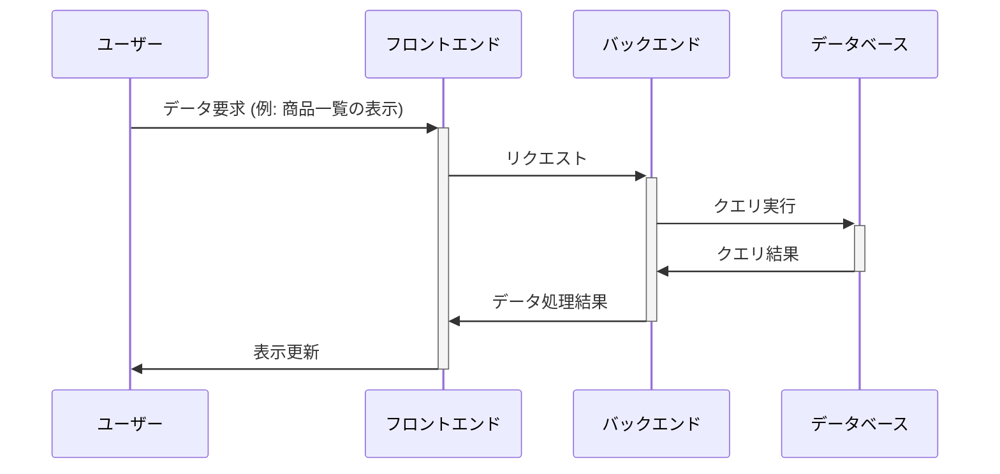
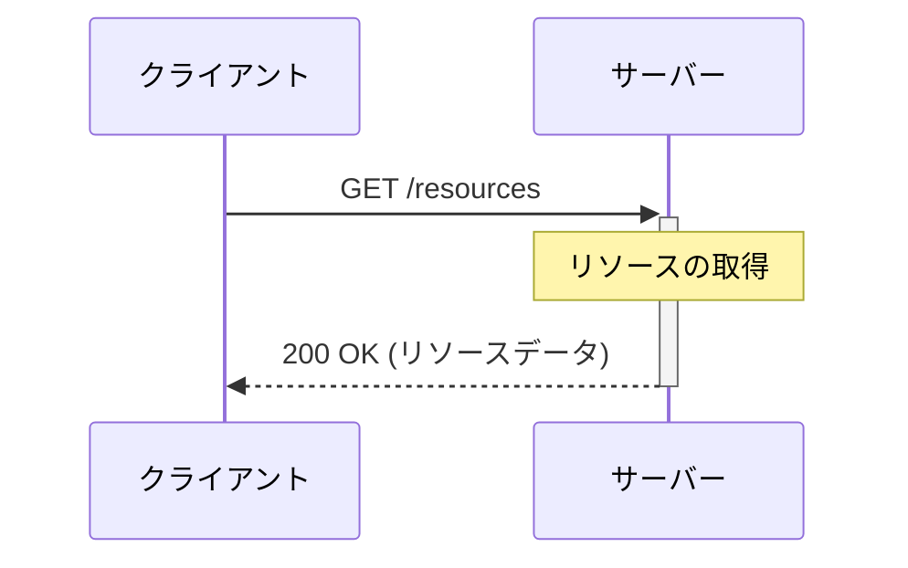
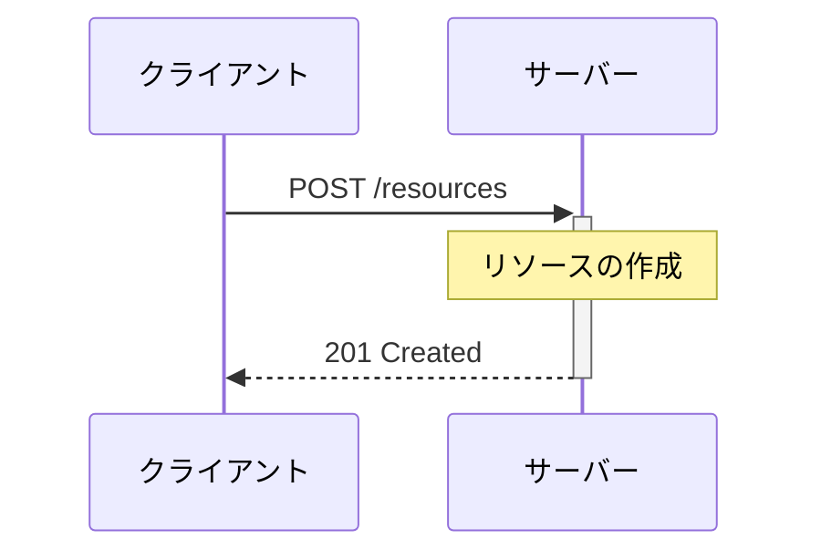
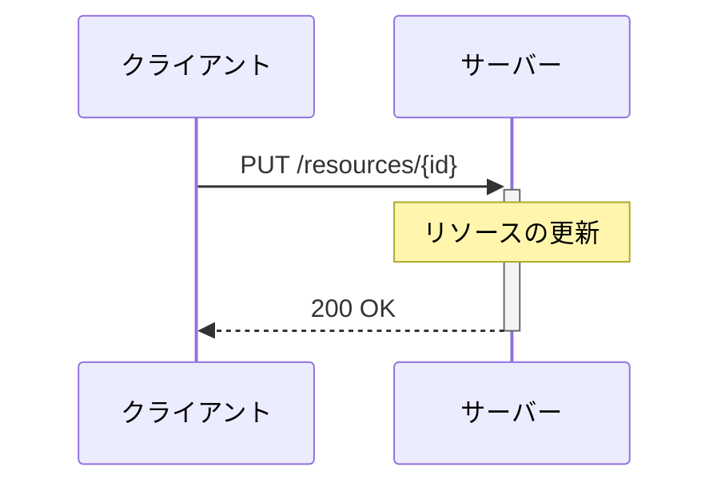
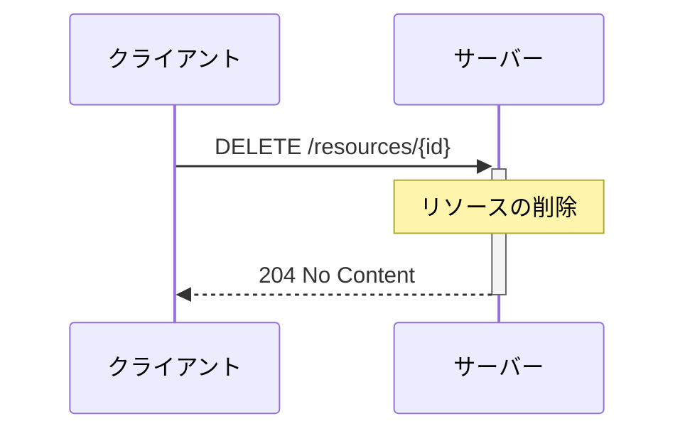
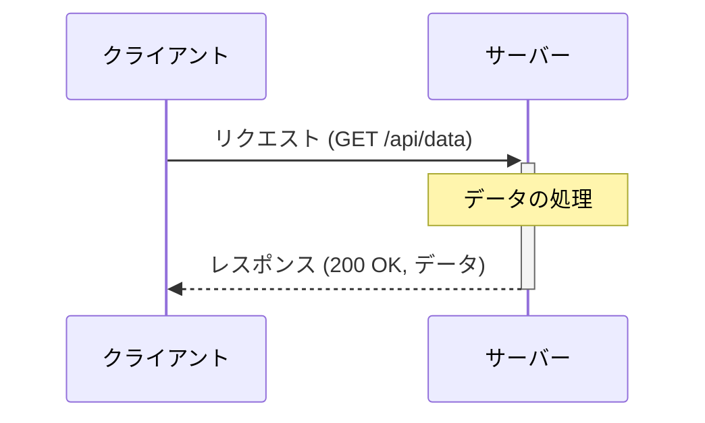

# WebアプリケーションとAPIの基礎

---

# 講義のアジェンダ

1. Webアプリケーションの概要
2. Webアプリケーションのアーキテクチャ
3. APIとは何か？
4. RESTful APIの基礎
5. APIを利用したデータ交換
6. 簡単なAPIのデモと実装
7. Q&A

<!--
このセクションでは、講義全体の流れと各トピックについて簡単に紹介する。  
質問があれば、いつでも遠慮なく聞いて。  
-->

---

# Webアプリケーションの概要

- Webアプリケーションとは
- Webサイトとの違い
- 一般的なWebアプリケーションの例

---

# Webアプリケーションの概要

Webアプリケーションとは、ウェブブラウザを通じて使用されるアプリケーションである。  
従来のデスクトップアプリケーションとは異なり、インストール不要で、インターネット経由でサービスを利用できる。  
この特性により、利用者は場所やデバイスを問わずにアクセス可能であり、アップデートもサーバー側で行われるため、常に最新の状態を保つことができる。  

---

# Webアプリケーションの特徴

Webアプリケーションの最大の特徴は、その普遍性にある。  
HTML、CSS、JavaScriptなどのウェブ標準技術を用いて開発され、どのようなオペレーティングシステムやデバイスからもアクセス可能である。  
また、クラウド技術の進展により、データの保存や処理をサーバー側で行うことが多くなり、ユーザーは軽量なクライアントデバイスでも高度な処理を享受できるようになった。  
これらの進化により、ビジネスアプリケーションからエンターテインメント、教育ツールまで、幅広い分野でWebアプリケーションが活用されている。  

---

# Webサイトの違い

WebアプリケーションとWebサイトの主な違いは、その目的とユーザーとの対話性にある。  
Webサイトは主に情報提供が目的であり、静的なコンテンツをユーザーに提供することが多い。  
一方、Webアプリケーションはユーザーの入力を受け取り、それに基づいて動的にコンテンツを生成したり、データを処理したりすることが特徴である。  

---

# 一般的なWebアプリケーションの例

企業のホームページやニュースポータルサイトは、ユーザーが情報を閲覧することが主な目的のWebサイトである。  
これに対して、オンラインバンキングやSNS、電子商取引のプラットフォームなどは、  
ユーザーが情報を投稿したり、商品を購入したりといった具体的なアクションを起こせるWebアプリケーションである。  
Webアプリケーションはしばしば、ユーザー認証やデータベースとのやり取りが必要となる複雑な処理を含んでいる。  

---

# Webアプリケーションのアーキテクチャ

- クライアント/サーバーモデル
- フロントエンドとバックエンド
- データベースとの連携

---
layout: two-cols

---

# クライアント/サーバーモデル

クライアント/サーバーモデルは、ネットワークアーキテクチャの一形態である。  
このモデルでは、サービスのリクエストを行うクライアントと、それに応答してサービスを提供するサーバーの2つの主要なコンポーネントが存在する。  
クライアントは、ウェブブラウザやアプリケーションなど、ユーザーが直接操作するインターフェースを提供し、  
サーバーは、Webページのホスティングやデータベースの管理、計算処理など、バックエンドでのデータ処理やストレージの役割を担う。  

::right::



---

# フロントエンドとは

フロントエンドとは、ユーザーが直接対話するウェブアプリケーションの部分である。  
主にウェブブラウザ上で実行され、HTML、CSS、JavaScriptなどの技術を使用して構築される。  
フロントエンドの主な目的は、ユーザーに快適で直感的なインターフェースを提供し、  
ユーザーのアクションに基づいて動的な表示や機能を実現することである。

---

# バックエンドとは

バックエンドとは、フロントエンドの背後で動作するサーバーサイドの部分である。  
データベースとのやり取り、サーバーの設定、アプリケーションのロジック処理などを担当し、  
主にサーバー上で実行されるプログラムやスクリプトを用いて構築される。  
バックエンドの役割は、フロントエンドからのリクエストに対して適切なデータや結果を返すことにあり、  
セキュリティやデータ管理、アプリケーションの核となる処理を担う。

---

# フロントエンドとバックエンドの連携 - フロー



---

# データベースとの連携 - 概要

データベースとの連携は、Webアプリケーションにおいて重要な役割を果たす。  
データベースは、ユーザー情報、商品データ、トランザクション履歴など、  
アプリケーションが利用する様々なデータを格納し、管理するシステムである。  
Webアプリケーションのバックエンドは、このデータベースと連携し、  
データの読み書きや更新を行うことで、ユーザーに必要な情報を提供したり、  
ユーザーからの入力をデータベースに保存したりする。

---

# データベースとの連携 - プロセス

アプリケーションのバックエンドは、SQLやNoSQLといったデータベースクエリ言語を使用して、  
データベースに対する操作を実行する。  
例えば、ユーザーがWebフォームから送信したデータは、バックエンドを通じてデータベースに保存され、  
別のユーザーがその情報を要求した場合には、バックエンドがデータベースから該当のデータを取得し、  
フロントエンドを介してユーザーに表示される。  
このように、データベースとの連携によって、動的なコンテンツの生成やユーザーのアクションに基づく処理が可能になる。

---

# データベースとの連携 - フロー



---

# APIとは何か？

- API（アプリケーションプログラミングインターフェース）の定義
- APIの主な利点
- APIの種類

---

# APIとは？

API（Application Programming Interface）は、ソフトウェア間でのインタラクションを可能にする契約のことを指す。  
異なるシステム、アプリケーション、またはデバイス間でデータを交換し、機能を共有するための方法を提供する。  

---

# APIの主な利点

- **再利用性**: 一度開発した機能を、異なるプログラムやアプリケーションで再利用できる。
- **抽象化**: 複雑な内部処理を隠し、シンプルなインターフェースを提供する。
- **連携性**: 異なるプラットフォームや言語で書かれたアプリケーション間で容易に連携できる。

---

# APIの種類

- **ウェブAPI**: HTTPプロトコルを使用してウェブサービス間で通信を行う。RESTful APIが一般的な例。
- **ライブラリAPI**: 特定の言語やソフトウェアライブラリで提供される、プログラム構築のための関数やクラスなどの集合。
- **オペレーティングシステムAPI**: OSの機能にアクセスするためのAPI。ファイル操作やウィンドウ管理など、システムレベルの操作を可能にする。

---

# なぜAPIが重要なのか？

APIは、モダンなソフトウェア開発において不可欠な役割を果たす。  
マイクロサービスアーキテクチャ、クラウドコンピューティング、モバイルアプリケーション、IoTデバイスなど、様々な分野でAPIが活用されている。  
APIにより、開発の効率化、サービスの連携、イノベーションの促進が実現される。  

---

# RESTful APIの基礎

- RESTの原則
- HTTPメソッド（GET, POST, PUT, DELETE）
- URI設計のベストプラクティス

---

# RESTful APIとは

RESTful APIは、ウェブAPIの一種で、RESTアーキテクチャの原則に基づいて設計される。  
リソースの概念に基づくシンプルで標準化されたインターフェースを提供し、HTTPメソッド（GET, POST, PUT, DELETE）を利用してリソースの操作を行う。

---

# RESTの原則 - 概要

REST（Representational State Transfer）は、分散システム設計のためのアーキテクチャスタイルである。  
RESTの原則に基づくAPIは「RESTful」と呼ばれ、ステートレスな通信、リソースへのアクセス、統一インターフェースなどの特徴を持つ。  
これらの原則に従うことで、シンプルで拡張可能、かつ互換性の高いWebサービスを設計できる。

---

# RESTの原則 - 主な特徴

- **ステートレス性**: クライアントとサーバー間の通信はステートレスであり、各リクエストは独立して完全なものでなければならない。  
- **リソースの識別**: システム内のすべてのリソースは、一意の識別子（URI）を持ち、クライアントはこれを用いてリソースにアクセスする。  
- **統一インターフェース**: シンプルで一貫したインターフェースを通じてリソースの操作を行う。

---

# HTTPメソッド - 概要

RESTful APIでは、HTTPメソッドを用いてリソースに対する操作を表現する。  
主にGET、POST、PUT、DELETEの4つのメソッドが使用され、それぞれ読み取り、作成、更新、削除の操作に対応している。  
これにより、APIの利用者はHTTPプロトコルの標準に従ってリソースの管理を行うことができる。

---

# HTTPメソッド - 使用例

- **GET**: リソースの取得。サーバーから情報を取得するために使用される。
- **POST**: リソースの作成。新しいリソースをサーバーに追加するために使用される。
- **PUT**: リソースの更新。既存のリソースを更新するために使用される。
- **DELETE**: リソースの削除。指定されたリソースをサーバーから削除するために使用される。

---

# URI設計のベストプラクティス - 概要

RESTful APIのURI設計は、直感的で理解しやすいものでなければならない。  
リソースの階層構造を表現するためにパスを使用し、リソースの操作はHTTPメソッドによって表現される。  
良いURI設計は、APIの使いやすさとメンテナンス性を向上させる。

---

# URI設計のベストプラクティス - 具体例

- リソースは名詞で表現する。例: `/users`, `/orders`
- リソースのコレクションと個別のエンティティを区別する。例: `/users`（ユーザーのコレクション）、`/users/123`（IDが123のユーザー）
- アクションはリソースの状態変更をHTTPメソッドで表現し、URIにアクションを含めない。

---

# RESTful APIの設計 - GET フロー



---

# RESTful APIの設計 - POST フロー



---

# RESTful APIの設計 - PUT フロー



---

# RESTful APIの設計 - DELETE フロー



---

# APIを利用したデータ交換 - 概要

APIを通じたデータ交換では、クライアントがサーバーに対してリクエストを送信し、  
サーバーはそれに応じたレスポンスを返す。  
このプロセスは、HTTPプロトコルを基にしており、Webサービスの基礎を成す。

---

# リクエストの構造

リクエストは主に以下の部分で構成される：
- **HTTPメソッド**: サーバーで実行すべきアクションの種類（例：GET, POST, PUT, DELETE）。
- **URI**: アクセスしたいリソースの場所を指定する。
- **ヘッダー**: 認証情報、コンテンツタイプなどのメタデータを含む。
- **ボディ**: POSTやPUTリクエストで送信するデータ。JSON形式で記述されることが多い。

---

# レスポンスの構造

レスポンスは次の部分から成る：
- **ステータスコード**: リクエストが成功したかどうかを示す数値コード（例：200 OK, 404 Not Found）。
- **ヘッダー**: コンテンツタイプやセキュリティ関連の情報など、レスポンスに関するメタデータ。
- **ボディ**: クライアントに返される実際のデータ。リクエストに基づいた結果や情報が含まれる。

---

## GET サンプルリクエスト
```
GET /api/users/123 HTTP/1.1
Host: example.com
Accept: application/json
Authorization: Bearer {トークン}
```
<br>

## GET サンプルレスポンス

```
HTTP/1.1 200 OK
Content-Type: application/json
Content-Length: {長さ}

{
  "id": 123,
  "name": "John Doe",
  "email": "john@example.com"
}
```

---

## POST サンプルリクエスト
```
POST /api/users HTTP/1.1
Host: example.com
Content-Type: application/json
Authorization: Bearer {トークン}

{
  "name": "Jane Doe",
  "email": "jane@example.com"
}

```
<br>

## POST サンプルレスポンス

```
HTTP/1.1 201 Created
Content-Type: application/json
Content-Length: {長さ}

{
  "id": 124,
  "name": "Jane Doe",
  "email": "jane@example.com"
}

```

---

# データ交換のフロー図



---

# FastAPIによる簡単なAPIのデモと実装

- FastAPIの紹介
- 基本的なAPIの構築ステップ
- FastAPIを使用したデモの実装
- 開発者のためのツール（例: Swagger UI）

---

# FastAPIの紹介

FastAPIは、現代的で高速なWeb APIを構築するためのPythonフレームワークである。  
非同期処理をフルに活用し、高いパフォーマンスを実現している点が特徴である。  
Python 3.6+の型ヒントを利用した簡潔でエラーに強いコードの記述を可能にし、  
自動的にインタラクティブなAPIドキュメントを生成する。

FastAPIは、開発者がRESTful APIを迅速に開発できるように設計されており、  
データのバリデーション、シリアライゼーション、ドキュメント生成など、  
API開発に必要な多くの機能を備えている。

- 公式ドキュメント: [FastAPI](https://fastapi.tiangolo.com/)
- GitHubリポジトリ: [tiangolo/fastapi](https://github.com/tiangolo/fastapi)

FastAPIを使うことで、効率的かつ直感的にAPIを構築でき、  
PythonでのモダンなWeb開発を強力にサポートする。

---

# API構築の準備

APIを構築する前に、その目的と要件を明確にすることが重要である。  
利用者のニーズを理解し、提供したいデータや機能について決定する。  
この段階で、APIの仕様書や設計ドキュメントの作成を始めると良い。

---

# APIの設計

APIの設計は、開発プロセスにおいて中心的な役割を果たす。  
RESTful原則に従い、リソース指向のアーキテクチャを採用することが多い。  
エンドポイントの定義、HTTPメソッドの選択、レスポンス形式の決定などが含まれる。  
この段階で、OpenAPIのような仕様を用いてAPIのインターフェースを正式に定義すると有効である。

---

# APIの開発

設計が完了したら、APIの実装に移る。  
多くの場合、フレームワークを使用して開発を行う。PythonであればFastAPIやFlaskが、  
JavaScriptであればExpress.jsが選択肢として挙げられる。  
データベースとの連携、認証・認可の仕組み、エラーハンドリングなど、  
必要な機能を実装する。

---

# APIのテストとデプロイ

開発が一段落したら、APIをテストする。  
単体テスト、統合テストを行い、想定されるリクエストに対するレスポンスを検証する。  
PostmanやSwaggerなどのツールを使って、手動でのエンドポイントテストも有効である。  
問題がなければ、APIを本番環境にデプロイする。クラウドサービスやオンプレミスのサーバーに配置し、  
利用者に公開する。

---

# FastAPIを使用したデモAPIの構築

<div>
    <iframe width="100%" height="400"src="https://gist.github.com/ymzkryo/5f66fb90e9a8a9321fb51e404490ff9b.pibb"></iframe>
</div>

<!-- Gist URL: https://gist.github.com/ymzkryo/5f66fb90e9a8a9321fb51e404490ff9b -->

---

# Q&A

- 質疑応答のセッション

---
layout: end

---
---
