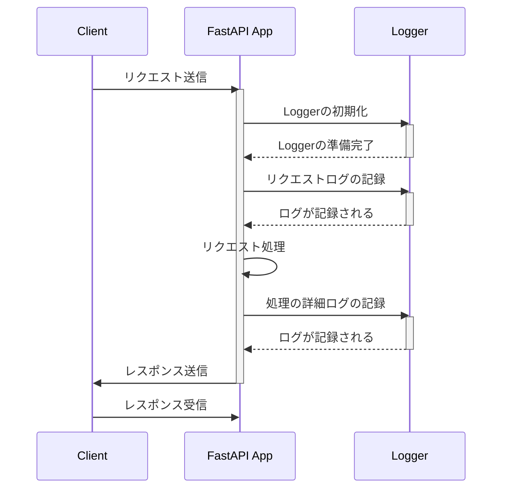

# ロギングとエラーハンドリング

---

# 講義のアジェンダ

- はじめに
- ロギング設計
- FastAPIでのロギング
- エラーハンドリング設計
- FastAPIでのエラーハンドリング
- Q&A
- おわりに

---

# はじめに

- ロギングとエラーハンドリングの定義
- 目的と重要性

<!--このセクションでは、ロギングとエラーハンドリングの基本的な定義から始めます。
ロギングとは、システムの実行時に発生したイベントを記録するプロセスである。エラーハンドリングは、プログラム実行中に発生したエラーを適切に処理する方法に関するものです。
ここでは、これらがなぜ開発プロセスにおいて重要であるのかについても説明します。
それでは、詳しく見ていきましょう。-->

---

# ロギングとエラーハンドリングの定義

- **ロギング**:
  - システムの実行時に発生したイベントを記録するプロセス
- **エラーハンドリング**:
  - プログラム実行中に発生したエラーを適切に処理する方法

<!--このスライドでは、ロギングとエラーハンドリングの基本的な定義について説明します。

まずロギングですが、これはシステムの実行中に発生する様々なイベントやデータを記録することです。これにより、後で何が起こったのかを確認でき、問題解決やパフォーマンス改善のための貴重な情報源となります。

次にエラーハンドリングについてです。これは、プログラムの実行中に予期せぬエラーが発生した場合に、それを捉えて適切に対処するプロセスを指します。エラーハンドリングにより、プログラムがクラッシュすることなく、エラーをログに記録し、ユーザーに適切なフィードバックを提供できます。

これらの概念は、ソフトウェア開発のあらゆる段階で非常に重要です。それでは、これらの概念を深掘りしていきましょう。-->

---

# ロギングの目的と重要性

- **目的**:
  - システムの動作状況と異常を記録し、可視化する。
  - 開発および運用中の問題解析と迅速なトラブルシューティングを支援する。

- **重要性**:
  - システムの正常な動作を保証し、エラーや不具合の早期発見に貢献する。
  - パフォーマンスの監視と最適化を可能にし、ユーザーエクスペリエンスを向上させる。
  - セキュリティ違反の検出と分析に不可欠。

<!--ロギングの目的は、システムの動作を透明にし、問題が発生したときにそれを特定しやすくすることにあります。これにより、開発チームは迅速に対応し、システムの正常な動作を維持することができます。

ロギングの重要性は非常に大きく、システム運用の基盤とも言えます。エラーや問題を早期に発見し、修正することで、システムの安定性を保つことができます。また、パフォーマンスのモニタリングを通じて、システムの最適化を図ることも可能です。セキュリティ面では、不正アクセスやデータ漏洩などのリスクを把握し、対策を講じるための重要な情報源となります。
-->

---

# エラーハンドリングの目的と重要性

- **目的**:
  - プログラムの実行中に発生したエラーを安全に処理し、プログラムのクラッシュを防ぐ。
  - ユーザーに対して適切なフィードバックを提供し、問題の解決を支援する。

- **重要性**:
  - システムの信頼性と堅牢性を確保し、ユーザーの信頼を維持する。
  - エラー発生時の適切な対応により、システムのダウンタイムを最小限に抑える。
  - 開発者がエラーの原因を迅速に特定し、修正することを容易にする。

<!--エラーハンドリングは、プログラム実行中のエラーを適切に管理し、より安定したシステム運用を目指すために不可欠です。これにより、ユーザーが直面する問題を最小限に抑え、より良い体験を提供することができます。

その重要性は、特にユーザーの信頼と直結しています。エラーが適切に処理されることで、システムはより信頼性高く、堅牢なものになります。また、問題発生時に迅速に対応することで、システムのダウンタイムを減らし、ビジネスへの影響を最小限に抑えることが可能です。開発者にとっては、エラーハンドリングを通じて問題の原因を特定しやすくなり、修正作業の効率が向上します。
-->

---

# ロギング設計

- ロギングの目的と基本原則
- local開発環境 vs. production環境
- ロギングレベルと使用例
- ログのフォーマットと構造

<!--このセクションでは、ロギングの設計について深く掘り下げていきます。ロギングの目的は多岐にわたりますが、主にシステムの透明性を高め、問題解決を助けることにあります。基本的に、ロギングはシステム運用の重要な側面であり、効果的なロギング戦略は開発から運用までのあらゆる段階で価値を提供します。

まず、ロギングの目的と基本原則についてですが、ロギングはシステムの動作を理解し、問題が発生した際に原因を追究するための手段を提供します。ここで重要なのは、何を、いつ、どのようにログに記録するかを明確に定義することです。また、ログを生成することのパフォーマンスへの影響を最小限に抑えることも考慮する必要があります。

次に、local開発環境とproduction環境におけるロギングの違いに触れます。開発環境では、デバッグや問題解析を容易にするために詳細なログが必要になることがあります。一方で、production環境では、パフォーマンスへの影響を考慮し、エラーログや重要な情報のみを記録することが一般的です。

ロギングレベルについては、DEBUG、INFO、WARNING、ERROR、CRITICALといったレベルが存在し、それぞれのレベルは異なる重要度の情報を表します。使用例を通じて、これらのレベルを適切に使い分けることの重要性について話します。

最後に、ログのフォーマットと構造についてです。ログの有用性はその内容と構造に大きく依存します。一般的に、タイムスタンプ、ログレベル、メッセージ、エラーコードなどを含めることが推奨されます。ログを構造化することで、分析や監視ツールによる処理が容易になります。

それでは、各ポイントについて詳しく見ていきましょう。
-->

---

# ロギングの目的と基本原則

- **目的**:
  - システムの動作状況を記録し、可視化する
  - 問題の早期発見と迅速なトラブルシューティングを支援する
  - 運用の透明性を高め、システムの信頼性を確保する

- **基本原則**:
  - 必要最小限の情報を記録する
  - ログのパフォーマンスへの影響を最小限に抑える
  - システムのセキュリティを損なわない情報のみをログに記録する
  - ログの構造を一貫させ、分析しやすくする
<!--ロギングの主な目的は、システムの動作状況を記録し、問題が発生した際に原因を特定できるようにすることです。これにより、運用の透明性が高まり、エラーや不具合の早期発見に繋がります。また、システムの信頼性を維持し、最終的にはユーザーの満足度を向上させることができます。

しかし、効果的なロギングを実現するためには、いくつかの基本原則を理解し、実践する必要があります。第一に、ログに記録する情報は必要最小限に抑えるべきです。これは、パフォーマンスへの影響を最小限に抑え、ログファイルのサイズを管理可能に保つためです。また、ログに記録する情報が多すぎると、重要な情報を見逃す可能性があります。

次に、ログのパフォーマンスへの影響を常に意識することが重要です。ロギングはシステムのパフォーマンスに影響を与えるため、効率的なロギング戦略が求められます。さらに、セキュリティを損なうような情報はログに記録すべきではありません。例えば、ユーザーの個人情報やパスワードなどがこれに該当します。

最後に、ログの構造を一貫させることで、ログの分析が容易になります。一貫したフォーマットを使用することで、ログ分析ツールを効果的に活用できるようになります。

それでは、これらの原則に基づいて、ロギング戦略をどのように設計していくか見ていきましょう。
-->

---

# local開発環境 vs. production環境

- **local開発環境**:
  - デバッグやトラブルシューティングを容易にするために詳細なログを出力する。
  - パフォーマンスへの影響が少ない環境で、より多くの情報を提供する。

- **production環境**:
  - ユーザーデータやシステムの安全性を考慮して、重要な情報のみをログに記録する。
  - パフォーマンスやリソースの消費を最小限に抑えるために、ログレベルを適切に設定する。

<!--ロギングの設計を考える上で、local開発環境とproduction環境では異なるアプローチが必要です。開発環境では、問題解析やデバッグのために詳細なログが求められます。これにより、開発者はコードの挙動を深く理解し、問題の原因を迅速に特定できるようになります。例えば、DEBUGレベルのログを豊富に出力して、システムの内部動作を詳細に追跡することがあります。

一方、production環境では、システムのパフォーマンスやセキュリティが最優先事項となります。ユーザー体験に影響を与えることなく、また機密情報を守りながら、重要なイベントやエラー情報のみを記録することが求められます。これは、ERRORやWARNINGといったより高いログレベルに設定を限定し、ログの量を抑えることで実現されます。また、不正アクセスの試みやシステムの重大な障害など、セキュリティ上重要な情報を捉えるために、適切なアラートや監視システムと組み合わせることが一般的です。

要するに、開発環境と本番環境では、ロギングの目的が異なります。開発環境では詳細な情報が役立ちますが、本番環境ではシステムの安定性とセキュリティが最も重要となるため、ログの量や種類を厳選する必要があります。

それでは、これらの環境ごとに適切なロギング戦略をどのように選択するか、詳しく見ていきましょう。
-->

---

# ロギングレベルと使用例

- **DEBUG**:
  - 開発中の詳細なデバッグ情報。システムの内部動作をトレースするために使用。
- **INFO**:
  - システムの正常な動作や重要なイベントの記録。運用情報の提供に役立つ。
- **WARNING**:
  - 潜在的な問題を示す警告。即時の対応は不要だが、注意が必要。
- **ERROR**:
  - 実行時エラーや期待されない問題の発生を示す。即時の対応が必要。
- **CRITICAL**:
  - システムに重大な影響を及ぼす問題。システムの停止や重大な機能障害が含まれる。

<!--ロギングレベルを理解し適切に利用することは、効果的なロギング戦略の基礎です。各レベルは特定の情報の重要度を反映しています。ここで、それぞれのロギングレベルとその使用例について詳しく説明します。

まず、DEBUGレベルは、開発者がシステムの内部動作を詳しく追跡し、問題の診断を行う際に非常に役立ちます。これは、ローカル開発環境で最も多用されるレベルで、通常、本番環境では無効にされることが多いです。

INFOレベルは、システムが正常に動作していることを示すメッセージや、ユーザーが重要なアクションを行った際の記録に使用されます。例えば、ユーザーのログインや重要なデータの更新がこのレベルでログに記されることがあります。

WARNINGレベルは、問題が起こる可能性のある事象を記録します。これは、システムの動作には直接影響しないが、将来的なエラーの原因となる可能性があるため、注意が必要です。例えば、ディスクの使用量が閾値に近づいている場合などがこれに該当します。

ERRORレベルは、エラーが発生し、それがシステムの一部の機能に影響を及ぼす場合に使用されます。例えば、外部APIからの応答失敗やデータベースエラーなどがこのレベルで報告されます。

最後に、CRITICALレベルは、システムの停止やデータの損失、重大なセキュリティ違反など、システム全体に深刻な影響を与える問題に対して使用されます。このレベルのログは、即座に対応を要する事態を示しており、適切な警告システムと連動していることが重要です。

それでは、これらのロギングレベルを効果的に活用し、システムの健全性を維持する方法について考えてみましょう。
-->

---

# ログのフォーマットと構造

- **フォーマットの一例**:
  - `時間 [ログレベル] メッセージ`
  - JSONフォーマット: `{"time": "時間", "level": "ログレベル", "message": "メッセージ"}`

- **重要な要素**:
  - **時間**: イベントが記録された正確な時刻。
  - **ログレベル**: DEBUG, INFO, WARNING, ERROR, CRITICALのいずれか。
  - **メッセージ**: イベントの内容を説明するテキスト。

- **構造の重要性**:
  - ログ分析とモニタリングツールの有効活用。
  - システムの問題解析とトラブルシューティングの迅速化。

<!--このスライドでは、効果的なロギングのために非常に重要な要素であるログのフォーマットと構造について説明します。ログのフォーマットとは、ログメッセージがどのように記述され、どの情報が含まれるかを定義するものです。適切なフォーマットを選択することで、ログから情報を効率的に抽出し、分析することが可能になります。

まず、ログには必ず時間、ログレベル、そしてメッセージが含まれるべきです。時間はイベントが発生した正確な時刻を捉え、ログレベルはそのイベントの重要度を示します。メッセージ部分には、イベントの詳細な説明が含まれます。

一般的なテキストベースのフォーマット例としては、「時間 [ログレベル] メッセージ」という構造がよく使用されます。しかし、最近では、JSON形式でのログ記録が増えています。JSONフォーマットでは、各要素をキーと値のペアで明確にすることができ、これによりログの解析が容易になります。例えば、`{"time": "2021-01-01T12:00:00", "level": "ERROR", "message": "An error occurred"}`のように記述されます。

ログの構造が一貫していると、ログ分析ツールやモニタリングシステムがログデータをより効果的に処理できるため、システムの監視やトラブルシューティングが迅速に行えます。一貫性のあるログフォーマットは、特に大規模なシステムや複数のサービスが絡む環境での効率的な運用に不可欠です。

それでは、ログのフォーマットと構造がなぜ重要であるか、その具体的な利点についてさらに詳しく見ていきましょう。
-->

---

# FastAPIでのロギング

- 設定方法
- ベストプラクティスと例

<!--このセクションでは、FastAPIアプリケーションにおけるロギングの設定方法とベストプラクティスについて詳しく見ていきます。FastAPIは非常に柔軟で強力なフレームワークであり、効果的なロギング設計を容易に実装できるツールを提供します。

まず、FastAPIでのロギング設定方法について説明します。FastAPIは標準のPython `logging` ライブラリと完全に互換性がありますので、このライブラリを使用してアプリケーションのロギングシステムを構築できます。基本的な設定では、`logging.basicConfig`関数を使用してロガーを設定し、必要に応じてログレベルやログファイルのパスを指定します。例えば、開発中はデバッグ情報が豊富な`DEBUG`レベルを設定し、本番環境では`INFO`や`WARNING`レベルに切り替えるといった調整が可能です。

次に、ベストプラクティスについてです。FastAPIを使用する際のロギングのベストプラクティスとしては、まずAPIの各エンドポイントで発生する重要なイベントを記録することが挙げられます。これには、リクエストの受付、処理の成功または失敗、重要なビジネスロジックの実行などが含まれます。また、エラーハンドリングを適切に行い、`ERROR`レベルでのログを適宜記録することが非常に重要です。これにより、システムの障害や不具合を迅速に特定し、対処することができます。

さらに、ログ出力のフォーマットにも注意を払うべきです。例えば、ログにはリクエストIDを含めることで、後からログを追跡しやすくなります。また、ログメッセージは明確で理解しやすい内容にすることが重要です。これらのベストプラクティスを適用することで、FastAPIアプリケーションのメンテナンス性と監視の効率が大幅に向上します。

それでは、具体的なコード例を見て、これらの概念を実際のアプリケーション設計にどのように組み込むかを学んでいきましょう。
-->
---

# 設定方法

- **Loggerの初期化**:
  - `logging` ライブラリを使用し、基本設定を行う。

- **リクエストログ**:
  - ミドルウェアを使用して、全リクエストの詳細をログに記録。

- **重要イベントの記録**:
  - APIのキー操作でログを取ることで、追跡とデバッグを容易に。

- **エラーログ**:
  - エラー発生時に重要情報を捉え、即座に記録。

<!--このスライドでは、FastAPIアプリケーションにおけるロギングの設定方法について説明します。ロギングはアプリケーションの動作を理解し、問題を診断するために不可欠なツールです。

まず、`logging` ライブラリを使用してLoggerを初期化します。これは、アプリケーション全体で一貫したログ設定を提供します。`basicConfig`メソッドを使って、ログレベルやフォーマット、出力先などの基本設定を行うことができます。例えば、デバッグ中は`DEBUG`レベルを設定し、本番環境では`INFO`レベル以上のログを取るように設定するのが一般的です。

次に、全てのHTTPリクエストとレスポンスの詳細を記録するためにミドルウェアを使用します。これにより、リクエストのメソッド、URL、ステータスコードなどの情報をログに自動的に記録することができ、アプリケーションの使用状況やパフォーマンスを効果的に監視することが可能になります。

また、APIの重要な操作、例えばデータベースへのアクセスや外部サービスとのインタラクションに関連するイベントを記録することが重要です。これにより、アプリケーションの動作をより深く理解し、問題が発生した場合に迅速に原因を特定できます。

最後に、エラーハンドリングのロギングも非常に重要です。システムエラーや予期せぬ例外が発生した場合、関連する情報をログに記録し、問題解決のための重要な手がかりを提供します。

これらのステップを適切に設定することで、FastAPIアプリケーションの運用とメンテナンスが大幅に改善されます。それでは、具体的な設定例を見ていきましょう。
-->
---

# 設定方法 - 処理フロー



---

# 設定方法 - サンプルコード

```python
import logging
from fastapi import FastAPI, Request

# ログ設定
logging.basicConfig(level=logging.INFO)
logger = logging.getLogger(__name__)

app = FastAPI()

@app.middleware("http")
async def log_requests(request: Request, call_next):
    logger.info(f"Received request: {request.method} {request.url}")
    response = await call_next(request)
    logger.info(f"Response status code: {response.status_code}")
    return response

@app.get("/")
async def main():
    logger.info("Processing main endpoint")
    return {"message": "Hello World"}

# このAPIを実行するには、`uvicorn main:app --reload` を使用します。

```

<!--このコードサンプルでは、FastAPIを使用して基本的なロギング設定を行う方法を示しています。まず、Pythonの標準ライブラリである`logging`を使用して、アプリケーション全体のログレベルを`INFO`に設定しています。これにより、INFOレベル以上のログ（INFO, WARNING, ERROR, CRITICAL）が記録されます。

次に、FastAPIのミドルウェア機能を使用して、すべてのHTTPリクエストとレスポンスをロギングするための設定を行います。`log_requests`関数は、各リクエストが処理される前後でログを記録するために定義されています。リクエストが受け取られると、そのメソッドとURLをログに記録し、次にそのリクエストを処理し、最後にレスポンスのステータスコードをログに記録します。この流れにより、リクエストのライフサイクル全体を追跡しやすくなります。

また、`main`関数はルートエンドポイント`"/"`で定義されており、このエンドポイントにアクセスがあった際には、「Processing main endpoint」というログが記録され、JSON形式のメッセージ「Hello World」がレスポンスとして返されます。

このAPIをローカルで実行するには、コマンドラインから`uvicorn main:app --reload`を実行します。`--reload`オプションは開発中にコードの変更が即時に反映されるようにするためのものです。

以上の設定により、開発者はアプリケーションの動作をリアルタイムで把握し、必要に応じて迅速に対応できるようになります。これがFastAPIでの効果的なロギング設定の一例です。
-->

---

# ベストプラクティスと例

- **構造化されたログ**:
  - JSON形式でログを出力し、解析と監視を容易にする。

- **適切なログレベルの使用**:
  - DEBUG, INFO, WARNING, ERROR, CRITICALを状況に応じて適切に使い分ける。

- **依存関係の注入を利用したロギング**:
  - リクエストごとの情報をログに含めるために依存関係注入を活用する。

- **実例**:
  - リクエストデータとレスポンスデータをログに記録する方法を示す。

<!--このスライドでは、FastAPIを使用した効果的なロギング戦略のベストプラクティスと具体的なコード例について説明します。

まず、構造化されたログについてです。JSON形式でのログ出力は、ログの自動解析やリアルタイムでの監視システムへの統合を非常に容易にします。これにより、エラーの迅速な特定やパフォーマンスのモニタリングが可能になります。

次に、ログレベルの適切な使用が重要です。各ログレベル（DEBUG, INFO, WARNING, ERROR, CRITICAL）は、その重要性に応じて使い分けることが推奨されます。例えば、開発中はDEBUGレベルで詳細な情報を出力し、本番環境ではINFO以上のレベルを主に使用します。

また、依存関係の注入を利用したロギングも非常に有効です。FastAPIの依存関係注入システムを使って、リクエストスコープでのデータを各リクエストのログに自動的に含めることができます。これにより、リクエストのコンテキストを維持しながら問題を追跡しやすくなります。

ここで具体的な実例を挙げます。リクエストデータとレスポンスデータをログに記録する以下のような方法が考えられます：
-->

---

# ベストプラクティスと例 - サンプルコード

```python
from fastapi import FastAPI, Request
import logging

app = FastAPI()
logging.basicConfig(level=logging.INFO)
logger = logging.getLogger(__name__)

@app.middleware("http")
async def log_request_response(request: Request, call_next):
    logger.info(f"Request: {request.method} {request.url} {request.headers}")
    response = await call_next(request)
    logger.info(f"Response: {response.status_code} {response.headers}")
    return response
```

<!--このサンプルコードは、FastAPIを使ってHTTPリクエストとレスポンスの詳細をログに記録する方法を示しています。ここで使われている技術や機能について詳しく見ていきましょう。

まず、FastAPIのインスタンスを作成しています。`FastAPI()` コンストラクタを呼び出すことで、新しいアプリケーションが生成されます。

次に、`logging`ライブラリを用いてロギングの基本設定を行っています。`basicConfig`メソッドでログのレベルを`INFO`に設定しています。これにより、INFOレベル以上のログ（INFO, WARNING, ERROR, CRITICAL）が出力されるようになります。また、`getLogger(__name__)`を通じて、このファイル専用のロガーを取得しています。

重要な部分は、`@app.middleware("http")`デコレータを使用したミドルウェアの定義です。このミドルウェアは、すべてのHTTPリクエストとレスポンスをインターセプトしてログに記録します。ミドルウェア関数`log_request_response`は、リクエストオブジェクトを引数として受け取り、そのメソッド、URL、ヘッダーをログに記録します。その後、`call_next`関数を呼び出してリクエストを次の処理へと渡し、そのレスポンスを受け取ります。レスポンスが得られた後、そのステータスコードとヘッダーをログに記録し、最終的にレスポンスを返しています。

このミドルウェアを使用することで、アプリケーションを通じて行われるすべてのリクエストとレスポンスの詳細をリアルタイムで監視できるようになります。これは、問題の診断やシステムの監視、セキュリティの分析に非常に役立ちます。

このようにして、このサンプルコードはFastAPIの強力なミドルウェア機能を活用して、効果的なロギングシステムを構築する方法を示しています。
-->
---

# 構造化されたログ

- **定義**:
  - ログデータが一定のフォーマットや構造を持っていること。
  
- **形式**:
  - 一般的にJSON形式でログを出力。

- **利点**:
  - ログの自動解析が容易。
  - 監視システムとの統合がスムーズ。
  - エラー追跡と問題解決の効率化。

<!--このスライドでは、効果的なロギングプラクティスの一つとして、構造化されたログについて詳しく見ていきます。構造化されたログとは、ログデータが予め定義されたフォーマットまたは構造を持っていることを意味します。このアプローチの最も一般的な形式は、JSON形式でのログ出力です。

JSON形式でログを出力する主な利点は、ログの自動解析が非常に容易になることです。これにより、リアルタイムでの監視システムとの統合がスムーズに行え、エラー追跡や問題解決のプロセスが効率化されます。例えば、ログから特定のエラーコードや重要な情報を素早く抽出することが可能です。

具体的な実装例として、FastAPIアプリケーションでリクエストとレスポンスのデータをJSON形式でログに記録する方法を挙げます。以下のようなコードで実現できます：
-->

---

# 構造化されたログ - サンプルコード

```python
import json
import logging
from fastapi import FastAPI, Request

app = FastAPI()
logger = logging.getLogger("fastapi_logger")

@app.middleware("http")
async def log_request_response(request: Request, call_next):
    request_data = await request.json()
    logger.info(json.dumps({"request": request_data, "path": request.url.path}))
    response = await call_next(request)
    logger.info(json.dumps({"response_status": response.status_code, "response_body": response.body}))
    return response
```

---

# 適切なログレベルの使用

- **ログレベルの種類**:
  - **DEBUG**: 開発中の詳細な情報。
  - **INFO**: 実行時の一般的なイベント。
  - **WARNING**: 潜在的な問題。
  - **ERROR**: 重大な問題、実行の失敗。
  - **CRITICAL**: システムの危機的状況。

- **ベストプラクティス**:
  - 状況に応じて適切なレベルを選択。
  - 開発ではDEBUGレベルを多用し、本番ではINFO以上を推奨。

- **具体的な例**:
  - システムエラーをERRORとして記録。
  - ユーザーの重要なアクションをINFOとして記録。

<!--このスライドでは、FastAPIを使用したアプリケーション開発におけるログレベルの適切な使用について解説します。ログレベルを適切に使い分けることは、効率的な問題解決とシステムの状態把握に非常に重要です。

ログレベルには、DEBUGからCRITICALまでの範囲があります。DEBUGレベルは開発時に非常に詳細な情報を提供し、問題の診断に役立ちます。INFOレベルはシステムの正常な動作や重要なランタイムイベントを記録するのに適しています。WARNINGは潜在的な問題を示し、ERRORは実際に問題が発生したことを示します。CRITICALはシステムにとって危機的な状況を報告します。

ベストプラクティスとして、開発中はDEBUGレベルのログを積極的に使用し、本番環境ではINFOレベル以上のログを活用することを推奨します。これにより、本番環境でのパフォーマンスを最適化しつつ、必要な情報を得ることができます。

具体的な使用例として、システムエラーが発生した場合にはERRORレベルでログを記録し、ユーザーが注文を完了したような重要なアクションはINFOレベルで記録することが挙げられます。これにより、ログデータから重要な情報を迅速に抽出し、問題が発生した場合の迅速な対応が可能になります。

このようにログレベルを適切に管理することで、開発効率とシステムの安定性を向上させることができます。
-->
---

# 適切なログレベルの使用 - サンプルコード

## 環境変数を使ってログレベルを設定する例

```python
# app/main.py

import logging
import os

log_level = os.getenv("LOG_LEVEL", "DEBUG")  # 環境変数からログレベルを取得、デフォルトはDEBUG
logging.basicConfig(level=log_level)
logger = logging.getLogger(__name__)
```

---

# 適切なログレベルの使用 - サンプルコード

## 環境変数を使ってログレベルを設定する例

```yaml
# docker-compose.yml

version: '3.8'
services:
  app:
    build: .
    environment:
      - LOG_LEVEL=INFO  # デフォルトはINFOに設定
    ports:
      - "8000:8000"
    volumes:
      - .:/code
```

---

# 適切なログレベルの使用 - サンプルコード

## 環境変数を使ってログレベルを設定する例

```yaml
# docker-compose.dev.yml

version: '3.8'
services:
  app:
    environment:
      - LOG_LEVEL=DEBUG  # 開発環境ではDEBUGに設定
```
```yaml
# docker-compose.prod.yml

version: '3.8'
services:
  app:
    environment:
      - LOG_LEVEL=INFO  # 本番環境ではINFOに設定

```

<br>

### 各環境実行時  
```
$ docker compose -f docker-compose.yml -f docker-compose.dev.yml up # 開発環境
$ docker compose -f docker-compose.yml -f docker-compose.prod.yml up # 本番環境
```

---

# 依存関係の注入を利用したロギング

- **目的**:
  - ログにコンテキスト情報を含めることで、問題の診断と追跡を効率化。

- **方法**:
  - FastAPIの依存関係注入システムを利用して、リクエストごとの詳細な情報をロギング。

- **利点**:
  - 各リクエストのコンテキストが明確になる。
  - エラー発生時の迅速な原因特定と解決支援。

- **具体的な実装例**:
  - リクエスト情報を含むカスタムロガーの設定方法を示す。

<!--このスライドでは、FastAPIの強力な依存関係注入システムを利用して、各リクエストに関連した詳細情報をログに含める方法について解説します。依存関係注入を使用することで、アプリケーションの各部分で必要な情報を簡単に取り込み、ロギング時に活用することができます。

このアプローチの主な目的は、ログにリクエストのコンテキスト情報を含めることです。これにより、問題が発生した際に、そのリクエストの詳細を追跡しやすくなり、迅速に問題解決に取り組むことが可能になります。

たとえば、ユーザーIDやセッション情報など、リクエストに紐づく特定のデータをロギングすることが考えられます。この情報はエラー解析やシステムの監視に非常に役立ちます。

具体的な実装例を以下に示します。この例では、カスタムのロギング依存関係を作成し、各リクエストに基づいて特定のデータをログに自動的に含める方法を説明します。
-->

---

# 依存関係の注入を利用したロギング - サンプルコード

```python
from fastapi import Depends, Request, FastAPI
import logging

app = FastAPI()

def get_logger(request: Request):
    user_id = request.headers.get("X-User-ID", "anonymous")
    return logging.getLogger(f"user_{user_id}")

@app.get("/")
async def read_main(logger: logging.Logger = Depends(get_logger)):
    logger.info("Processing main request")
    return {"message": "Hello World"}

# この方法では、X-User-IDヘッダーからユーザーIDを取得し、そのユーザー固有のログを生成します。
```

<!--
# 依存関係の注入を利用したロギング - サンプルコードの解説

このコードは、FastAPI を使用した Web アプリケーションで、依存関係の注入（Dependency Injection）を利用してリクエストごとにカスタマイズされたロギングを実行する方法を示しています。

## 1. 依存関係の定義

- `get_logger` 関数は、`Request` オブジェクトを受け取ります。これにより、リクエストの詳細にアクセス可能です。
- リクエストヘッダーから `X-User-ID` を取得します。このヘッダーが存在しない場合は、デフォルトで "anonymous" が使用されます。
- 取得した `user_id` を使用して、そのユーザー固有のロガーを取得（または作成）します。ロガーは `f"user_{user_id}"` の形式で名前付けされ、ユーザーごとに個別のログを保持します。

## 2. エンドポイントの定義

- `@app.get("/")` により、ルートディレクトリ（`/`）への GET リクエストを処理するエンドポイントが定義されます。
- `read_main` 関数がこのエンドポイントで呼び出され、`logger` という引数が `Depends(get_logger)` によって注入されます。

## 3. ロギングの実行

- 注入されたロガーを使用して `logger.info("Processing main request")` によりログメッセージが記録されます。
- ログにはどのユーザーがリクエストを行ったかという情報が含まれ、後からの追跡を容易にします。

## 4. レスポンスの返却

- 関数は最終的に `{"message": "Hello World"}` の辞書を JSON 形式でレスポンスとして返します。

この方法は、ユーザー固有の情報をログに記録しやすくし、セキュリティ監視やデバッグ時に特定のユーザーのアクティビティを特定しやすくするのに役立ちます。また、依存関係の注入を利用することで、コードの再利用性とテストの容易さも向上します。

-->

---

# エラーハンドリング設計
- エラーの種類と例外処理
- カスタムエラーの定義と使用方法

<!--
このセクションでは、エラーハンドリング設計の基本的な構成要素、すなわちエラーの種類と例外処理、さらにカスタムエラーの定義とその使用方法について詳しく説明します。

まず、「エラーの種類と例外処理」から見ていきます。エラーは大きく分けてシステムエラーとアプリケーションエラーに分類されます。システムエラーはハードウェアの障害や外部リソースの不具合など、アプリケーション外部の問題に起因するものです。一方、アプリケーションエラーはソフトウェアのバグや設計ミスなど、アプリケーション内部の問題によって発生します。例外処理は、これらのエラーに対処するために非常に重要です。例外処理を適切に行うことで、エラーが発生してもアプリケーションが適切に反応し、必要な情報をログに記録し、ユーザーにわかりやすいフィードバックを提供できます。

次に、「カスタムエラーの定義と使用方法」についてです。カスタムエラーを定義することで、アプリケーションの特定のエラー状態をより明確に表現できます。これにより、エラーの原因を特定しやすくなり、より効果的なエラー処理が可能になります。カスタムエラーはPythonでは例外クラスを継承して作成されます。例として、入力データのバリデーションエラーやリソースの取得失敗など、アプリケーション固有の状況を示すカスタムエラーを定義することが挙げられます。
-->

---

# エラーの種類と例外処理

- **システムエラー**:
  - ハードウェアの故障、ネットワークの問題など、システムレベルで発生。
  
- **アプリケーションエラー**:
  - ソフトウェアのバグ、プログラミングの誤りによるエラー。

- **ユーザーエラー**:
  - ユーザーの入力ミスや操作ミスによるエラー。

- **例外処理の実装**:
  - エラーをキャッチし、適切にハンドルしてシステムの安定性を保つ。

<!--このスライドでは、エラーの種類について説明し、それらを効果的に処理する方法について掘り下げていきます。

まず、「システムエラー」です。これはハードウェアの故障やネットワークの中断など、システムの基盤となるレベルで発生する問題を指します。システムエラーは予測不可能で、しばしば避けがたいものです。そのため、これらのエラーを適切にハンドルすることは、アプリケーションの信頼性を保つ上で非常に重要です。

次に、「アプリケーションエラー」についてです。これはソフトウェアのバグやプログラミングの誤りが原因で起こります。この種のエラーは開発プロセス中に発見しやすく、テストによって予防することが可能です。

「ユーザーエラー」は、ユーザーの入力ミスや誤操作によって引き起こされるエラーです。これらは通常、エラーメッセージを通じてユーザーに適切なフィードバックを提供することで対応します。

例外処理の実装では、これらのエラーを効果的にキャッチし、アプリケーションがクラッシュすることなくエラーを適切に処理することが重要です。具体的には、`try`と`except`ブロックを使用して例外を捕捉し、ログに記録してシステム管理者に通知することが一般的です。
-->

---

# DBエラー時の例外処理

```python
try:
    # データベース操作
    update_database(data)
except DatabaseError as e:
    logger.error(f"Database operation failed: {e}")
    raise HttpException(status_code=500, detail="Database error occurred")
```
<!--
このコードは、データベース操作中に何らかのエラーが発生した場合に、そのエラーをキャッチしてログに記録し、ユーザーには500エラーを返すようにしています。このように例外処理を適切に実装することで、システムの安定性を保ちつつ、ユーザーにも理解しやすい情報を提供できます。-->
---

# カスタムエラーの定義と使用方法

- **目的**:
  - 特定のエラーシナリオに対応し、コードの可読性と保守性を向上。

- **方法**:
  - Pythonの例外クラスを継承してカスタムエラークラスを作成。

- **利点**:
  - エラーハンドリングをより柔軟に制御。
  - 開発者にとって明確なエラー情報を提供。

- **具体的な例**:
  - ユーザー認証失敗、データ検証エラーなど、特定のエラーにカスタム例外を使用。

<!--このスライドでは、カスタムエラーを定義し、それを適切に使用する方法について解説します。カスタムエラーを定義することで、特定のエラーシナリオに対してより効果的に対応でき、エラーハンドリングのプロセスを明確にし、コードの保守性を向上させることができます。

カスタムエラーはPythonで例外クラスを継承して作成します。これにより、標準的なエラーよりも具体的なエラー情報を提供でき、エラーの原因を特定しやすくなります。また、これによりエラーハンドリングをより柔軟に制御でき、特定のエラーに対して特定の反応を設定することが可能です。
-->

---

# ユーザ認証プロセスで認証失敗時のカスタムエラー

```python
class AuthenticationError(Exception):
    def __init__(self, user, message="User authentication failed"):
        self.user = user
        self.message = message
        super().__init__(self.message)

try:
    authenticate_user(user)
except AuthenticationError as e:
    logger.error(f"{e.message} for user {e.user}")
    raise HttpException(status_code=401, detail=e.message)
```

<!--このカスタムエラーは、認証が失敗したユーザーの情報とともに例外を発生させることができます。例外をキャッチする際には、次のようにユーザー情報を使用して特定のログを出力したり、ユーザーに対して特定のフィードバックを返すことができます
このようにカスタムエラーを活用することで、エラーハンドリングが直感的で読みやすいものになり、開発者がエラーを迅速に理解し、適切な対応を取ることが容易になります。

カスタムエラーの使用は、エラーハンドリングのクオリティを高め、アプリケーションのロバストネスを向上させる重要な手段です。
-->

---

# FastAPIでのエラーハンドリング
- 設定方法
- ベストプラクティスと例

<!--このスライドでは、FastAPIを使用したエラーハンドリングの設定方法、ベストプラクティス、そして実用的な例について解説します。

まず、「設定方法」についてです。FastAPIでは、例外ハンドラを定義することで、アプリケーションで発生した例外を効果的にキャッチし、処理することができます。例外ハンドラを使用することで、エラー発生時に一貫したレスポンスを返すことが可能になり、APIの利用者に対してクリアなコミュニケーションを行うことができます。

次に、「ベストプラクティス」についてです。エラーハンドリングでは、適切なHTTPステータスコードを返すことが非常に重要です。これにより、クライアント側で適切な対応を取ることが可能になります。また、エラーメッセージは具体的かつ明確にすることが推奨されます。これにより、エラーの原因をクライアントが理解しやすくなり、必要に応じて修正や再試行を行えるようになります。
-->
---

# 設定方法

- **例外ハンドラの定義**:
  - `@app.exception_handler()` デコレータを使用してカスタム例外ハンドラを定義。

- **内蔵例外の利用**:
  - `HTTPException` を使用してHTTPステータスコードとメッセージを指定。

- **カスタム例外クラスの作成**:
  - 独自のエラーを表現するためにカスタム例外クラスを定義し、利用。

<!--このスライドは、FastAPIでのエラーハンドリングを設定する方法を説明します。例外ハンドラを定義することで、アプリケーション全体で発生する特定の例外を効果的にキャッチし、カスタマイズされたレスポンスを返す方法を示しています。カスタム例外クラスを作成し、それに対するハンドラも定義することで、より柔軟にエラーレスポンスを制御できます。これにより、開発者はアプリケーションのエラーハンドリングをより詳細に管理し、ユーザーに対して適切なフィードバックを提供できるようになります。-->

---

# 設定方法 - サンプルコード

```python
from fastapi import FastAPI, HTTPException, Request, status
from fastapi.responses import JSONResponse
from fastapi.exceptions import RequestValidationError

app = FastAPI()

# カスタム例外ハンドラの定義
@app.exception_handler(HTTPException)
async def http_exception_handler(request: Request, exc: HTTPException):
    return JSONResponse(
        status_code=exc.status_code,
        content={"detail": exc.detail}
    )

# バリデーションエラーのカスタムハンドリング
@app.exception_handler(RequestValidationError)
async def validation_exception_handler(request: Request, exc: RequestValidationError):
    return JSONResponse(
        status_code=status.HTTP_422_UNPROCESSABLE_ENTITY,
        content={"detail": exc.errors()}
    )

```

<!--
- HTTP例外のカスタムハンドリング  
@app.exception_handler(HTTPException)というデコレータを使い、HTTP例外のハンドリングを定義しています。
このハンドラは、受け取ったHTTP例外のステータスコードと詳細メッセージを含むJSONレスポンスを返します。
これにより、HTTP例外が発生した場合に適切なエラーメッセージがクライアントに返されます。
- バリデーションエラーのカスタムハンドリング  
@app.exception_handler(RequestValidationError)デコレータを使用し、バリデーションエラーのハンドリングを定義しています。
バリデーションエラーが発生した場合、HTTPステータスコード422（Unprocessable Entity）が返され、エラーの詳細がJSON形式でクライアントに返されます。
このように、FastAPIではexception_handlerデコレータを使用して、さまざまな種類のエラーに対するカスタムハンドリングを容易に定義できます。これにより、APIの堅牢性を高め、ユーザーエクスペリエンスを向上させることができます。
-->
---

# 設定方法 - サンプルコード(続き)

```python

# カスタム例外クラスとそのハンドラ
class CustomError(Exception):
    def __init__(self, name: str):
        self.name = name

@app.exception_handler(CustomError)
async def custom_error_handler(request: Request, exc: CustomError):
    return JSONResponse(
        status_code=418,  # I'm a teapot
        content={"message": f"Oops! {exc.name} did something. This is not allowed."}
    )
```
<!--
-  カスタム例外クラスの定義  
CustomErrorという新しい例外クラスが定義されています。
このクラスは、特定のユーザー定義の条件で発生するエラーを表します。
クラスのコンストラクタは、エラー名を引数として受け取り、インスタンス変数として保持します。
- カスタム例外ハンドラの定義  
@app.exception_handler(CustomError)デコレータを使用し、CustomErrorに対する例外ハンドラを定義しています。
カスタム例外が発生した場合、HTTPステータスコード418（I'm a teapot）が返され、エラーメッセージとしてカスタム例外の名前が含まれたJSONレスポンスがクライアントに返されます。
このように、FastAPIではカスタム例外クラスを定義し、それに対する例外ハンドラを設定することで、アプリケーション固有のエラーシナリオに柔軟に対応することができます。これにより、APIの信頼性と堅牢性を向上させることができます。
-->
---

# ベストプラクティスと例
- 適切なエラーコードの使用:
    - 各エラーシナリオに適したHTTPステータスコードを返す。
- カスタムエラーレスポンスの提供:
    - クライアントにわかりやすく、情報量の豊富なエラーレスポンスを提供する。
- 例外ハンドリングの適切な配置:
    - アプリケーション内で例外ハンドリングを適切な位置に配置し、適切なエラーハンドリングを行う。
- 詳細なエラーログの記録:
    - エラーが発生した場合、詳細なエラーログを記録し、問題の追跡とデバッグを容易にする。


<!--このスライドでは、FastAPIにおけるエラーハンドリングのベストプラクティスと実例について説明します。

- 適切なエラーコードの使用:  
各エラーシナリオに適したHTTPステータスコードを返すことで、クライアントに正確な情報を提供します。例えば、リソースが見つからない場合には404を、権限エラーが発生した場合には401を返します。
- カスタムエラーレスポンスの提供:  
クライアントが理解しやすく、問題を特定できるようなカスタムエラーレスポンスを提供します。エラーの詳細情報や解決策など、適切な情報を含めることが重要です。
- 例外ハンドリングの適切な配置:  
アプリケーション内で例外ハンドリングを適切な位置に配置することで、エラーハンドリングの一貫性と効果を確保します。例外が発生した場所に近い位置でハンドリングを行い、適切なエラーレスポンスを生成します。
- 詳細なエラーログの記録:  
エラーが発生した際には、詳細なエラーログを記録し、問題の追跡とデバッグを容易にします。ログにはエラーの発生箇所や原因、処理フローなどの情報を含めることで、問題の特定と修正を迅速に行えます。
これらのベストプラクティスを適用することで、FastAPIアプリケーションのエラーハンドリングを効果的に設計し、ユーザーエクスペリエンスの向上とシステムの信頼性を確保します。
-->
---

# ベストプラクティスと例 - サンプルコード

```python
from fastapi import FastAPI, HTTPException
from starlette.requests import Request
from starlette.responses import JSONResponse

app = FastAPI()

class CustomError(Exception):
    def __init__(self, name: str):
        self.name = name

@app.exception_handler(CustomError)
async def custom_error_handler(request: Request, exc: CustomError):
    return JSONResponse(
        status_code=418,
        content={"message": f"Oops! {exc.name} did something. This is not allowed."},
    )

@app.get("/items/{item_id}")
async def read_item(item_id: int):
    if item_id == 999:
        raise CustomError(name="Bad Item ID")
    return {"item_id": item_id}

```
<!--
1. カスタムエラークラスの定義:  
CustomErrorというカスタムエラークラスが定義されています。このクラスは、nameという属性を持ちます。この例では、name属性はエラーメッセージの一部として使用されます。
2. カスタムエラーハンドラの定義:  
@app.exception_handler(CustomError)デコレータを使用して、CustomErrorクラスのインスタンスを処理するためのカスタムエラーハンドラが定義されています。
このカスタムエラーハンドラは、custom_error_handlerという名前の非同期関数として定義されています。
リクエストとエラーのインスタンスが引数として受け取り、418のステータスコード（I'm a teapot）と共にカスタムエラーメッセージを含むJSONレスポンスを返します。
- エンドポイントの定義:  
/items/{item_id}エンドポイントに対するGETリクエストを処理するread_item関数が定義されています。
もしitem_idが999の場合、CustomErrorがスローされます。これにより、カスタムエラーハンドラがトリガーされ、クライアントに418のステータスコードとともに適切なエラーメッセージが返されます。
このサンプルコードを使用すると、FastAPIアプリケーション内でのカスタムエラーの処理が容易になります。
-->

---

# Q&A

## 質疑応答のセッション

---

# おわりに

- ロギングとエラーハンドリングの実践
- さらなる資源と学習のためのリンク

---

# 実践

## ロギングの実践

- ログレベルの設定:  
    適切なログレベル（DEBUG、INFO、WARNING、ERROR、CRITICAL）を選択し、それに基づいてログを出力します。開発環境では詳細な情報を含むDEBUGレベルを使用し、本番環境では重要な情報のみを含むINFOレベル以上を使用します。  

- 構造化されたログの使用:  
    ログを構造化された形式（JSONなど）で出力することで、ログの解析や監視を容易にします。
- ロギングの設定:  
    FastAPIアプリケーション内で適切なロギング設定を行います。これには、ログのフォーマットや出力先の設定が含まれます。
- ログの収集と分析:  
    ログを集めて分析し、アプリケーションの動作をモニタリングし、問題の追跡やトラブルシューティングに役立てます。

---

## エラーハンドリングの実践

- 例外処理の実装:  
    アプリケーション内で発生する可能性があるすべての例外に対する適切な処理を実装します。これには、try-exceptブロックの使用やカスタム例外の定義が含まれます。
- エラーハンドラの設定:  
    FastAPIアプリケーション内でエラーハンドラを設定し、エラーが発生したときに適切なレスポンスを返します。これには、HTTPエラーのハンドリングやカスタムエラーの処理が含まれます。
- エラーのログ記録:  
    エラーが発生した場合にログにエラー情報を記録し、問題のトラブルシューティングや解決に役立てます。

---

## 参考リンク集

- [FastAPI 公式ドキュメント](https://fastapi.tiangolo.com/)
- [Python Logging HOWTO](https://docs.python.org/3/howto/logging.html)
- [Python Logging Cookbook](https://docs.python.org/3/howto/logging-cookbook.html)
- [Python Logging Module](https://docs.python.org/3/library/logging.html)
- [Python Exceptions](https://docs.python.org/3/library/exceptions.html)
- [FastAPI Exception Handling](https://fastapi.tiangolo.com/tutorial/handling-errors/)
- [FastAPI Custom Exception Handling](https://fastapi.tiangolo.com/advanced/custom-response/)
- [FastAPI Dependency Injection](https://fastapi.tiangolo.com/tutorial/dependencies/)
- [FastAPI Logging](https://fastapi.tiangolo.com/tutorial/logging/)

