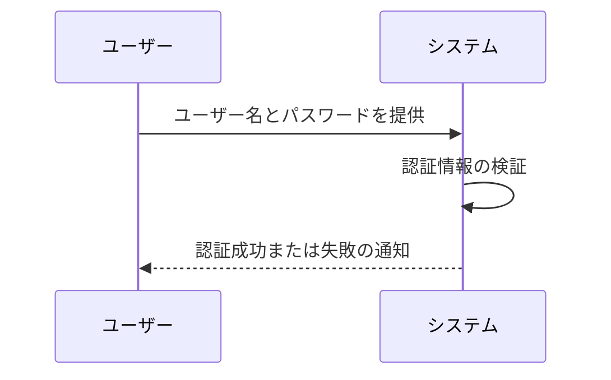
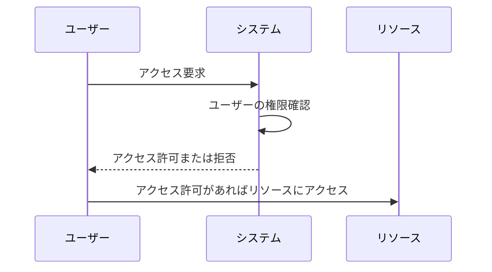
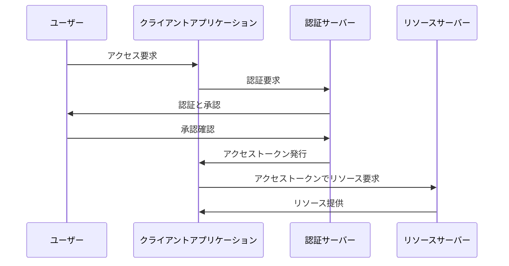
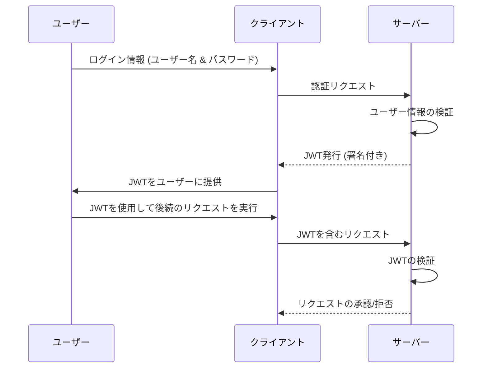
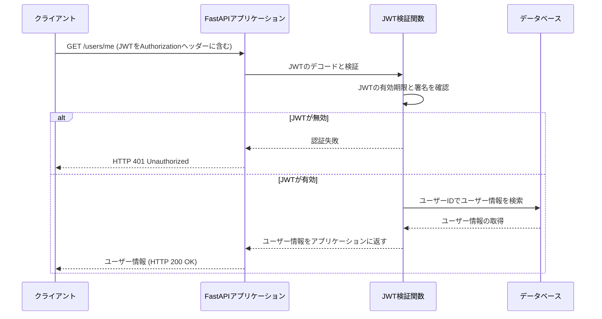

# APIの認証と認可の基礎

<!-- このページでは、APIにおける認証と認可の基本について解説します。認証と認可の違いとその重要性、そして実装方法について学びます。 -->

---

# 講義のアジェンダ

- 認証とは？
- 認可とは？
- 主要な認証技術
- OAuthの詳細
- 主要な認可技術
- APIセキュリティのベストプラクティス
- FastAPIにおける認証認可の実装
- Q&A

---

# 認証とは？

- **定義**: ユーザーが自分の身元を証明するプロセス。
- **目的**: システムが正しいユーザーと通信していることを保証。
- **方法**:
  - パスワード
  - バイオメトリクス
  - 二要素認証

<!-- このスライドでは認証の基本的な概念を紹介します。認証はシステムがユーザーの正当性を確認するための第一歩であり、セキュリティの基礎です。 -->

---

# 認証処理 - 処理フロー



---

# 認可とは？

- **定義**: 認証済みのユーザーが特定のリソースにアクセスできるかを決定するプロセス。
- **目的**: リソースへのアクセスを適切に制限することにより、セキュリティを保持。
- **方法**:
  - アクセス制御リスト (ACL)
  - ロールベースアクセス制御 (RBAC)
  - 属性ベースアクセス制御 (ABAC)

<!-- このスライドでは認可の基本的な概念を紹介します。認可は適切なユーザーが正しいリソースにアクセスできるようにするための重要なセキュリティ対策です。 -->

---

# 認可処理 - 処理フロー


---

# 主要な認証技術

- **技術**:
  - パスワードベース認証
  - 二要素認証
  - デジタル証明書
  - バイオメトリック認証

<!-- このスライドでは、現代の認証技術とその特徴について詳しく解説します。 -->

---

# パスワードベース認証

- **概要**: 最も一般的な認証形式で、ユーザーは事前に登録したパスワードを使用して自身を認証。
- **セキュリティ対策**:
  - 強力なパスワードポリシー
  - パスワードの定期的な更新
  - パスワードのハッシュ化

<!-- このスライドでは、パスワードベース認証の基本的な概念と、セキュリティを強化するためのベストプラクティスについて説明します。 -->

---

# 二要素認証

- **概要**: 二要素認証は、パスワードに加えて、何かユーザーが持っているもの（トークン、スマートフォンアプリ）を利用します。
- **利点**:
  - セキュリティの向上
  - 盗難やなりすましに対する保護

<!-- このスライドでは、二要素認証がどのように機能し、セキュリティをどのように強化するかについて説明します。 -->

---

# デジタル証明書

- **概要**: デジタル証明書を用いた認証は、公開鍵インフラストラクチャ（PKI）に基づいて、ユーザーの身元を確認します。
- **利点**:
  - 身元の信頼性の確保
  - セキュリティの非常に高いレベルの提供

<!-- このスライドでは、デジタル証明書の基本的な概念と、それがセキュリティにどのように貢献するかについて解説します。 -->

---

# バイオメトリック認証

- **概要**: 生体認証は、指紋、虹彩、顔認識など、ユーザー固有の生体情報を用いて認証を行います。
- **利点**:
  - 偽造や盗難が困難
  - ユーザーフレンドリー

<!-- このスライドでは、バイオメトリック認証の技術と、それが提供する独特のセキュリティ特性について詳しく説明します。 -->

---

# OAuthの詳細

- **概要**: サードパーティアプリケーションがユーザーの代わりにサーバーに安全にアクセスするためのオープンスタンダード。
- **利用シナリオ**: ソーシャルログイン、アクセス委譲。
- **流れ**:
  - リソースオーナーがアクセス許可を付与。
  - クライアントがアクセストークンを使用してリソースサーバーにアクセス。

<!-- このスライドではOAuthのプロトコルの流れと、それがどのようにユーザーとサービスプロバイダーの間で安全な認証と認可を提供するかを説明します。 -->

---

# OAuthの基本概念

- **目的**: サードパーティのアプリケーションがユーザーの許可を得て、安全にリソースへのアクセスを行うことを可能にする。
- **利点**:
  - ユーザーのログイン情報がサードパーティに露出しない。
  - アクセス権を細かくコントロールし、必要なリソースのみに限定可能。

<!-- このスライドでは、OAuthが解決する問題とその目的について説明します。 -->

---

# OAuthの処理フロー



---

# FastAPIでのOAuthの実装

```python
from fastapi import FastAPI, Depends, HTTPException, status
from fastapi.security import OAuth2PasswordBearer, OAuth2PasswordRequestForm

app = FastAPI()
oauth2_scheme = OAuth2PasswordBearer(tokenUrl="token")

def fake_decode_token(token: str):
    return {"username": "user1"} if token == "secret" else None
async def get_current_user(token: str = Depends(oauth2_scheme)):
    user = fake_decode_token(token)
    if not user:
        raise HTTPException(
            status_code=status.HTTP_401_UNAUTHORIZED,
            detail="Invalid authentication credentials",
            headers={"WWW-Authenticate": "Bearer"},
        )
    return user
@app.post("/token")
async def login(form_data: OAuth2PasswordRequestForm = Depends()):
    return {"access_token": form_data.username, "token_type": "bearer"}
@app.get("/users/me")
async def read_users_me(current_user: dict = Depends(get_current_user)):
    return current_user
```
---

# OAuthのセキュリティ上の考慮事項

- トークンの安全な保管: アクセストークンは機密情報であり、安全に保管する必要があります。
- 有効期限の設定: トークンには適切な有効期限を設け、期限切れ後に再認証を要求することが重要です。
- スコープの限定: トークンによるアクセスは、必要最小限のリソースに限定するべきです。

<!-- このスライドでは、OAuthを安全に使用するためのベストプラクティスについて説明します。トークンの保管、有効期限設定、アクセススコープの制限など、セキュリティを確保するための重要なポイントをカバーしています。 -->

---

# 主要な認可技術

- **技術**:
  - アクセス制御リスト (ACL)
  - ロールベースアクセス制御 (RBAC)
  - 属性ベースアクセス制御 (ABAC)
  - ポリシーベースアクセス管理 (PBAC)

<!-- このスライドでは、様々な認可技術とその適用例について解説します。 -->

---

# アクセス制御リスト (ACL)

- **概要**: アクセス制御リストは、ユーザーやグループがリソースに対して持つ権限を明確に定義します。
- **利点**:
  - 単純で理解しやすい
  - リソースごとに細かいアクセス制御が可能

<!-- このスライドでは、ACLの基本的な概念と、それを使用してリソースのセキュリティを管理する方法について解説します。 -->

---

# ロールベースアクセス制御 (RBAC)

- **概要**: RBACでは、ユーザーの役割に基づいてアクセス権限を付与します。
- **利点**:
  - 役割ごとに権限を管理することで、大規模な組織でも効率的に権限設定が可能
  - セキュリティポリシーの一貫性と維持が容易

<!-- このスライドでは、RBACの概念とその利点、および適用方法について詳しく説明します。 -->

---

# 属性ベースアクセス制御 (ABAC)

- **概要**: ABACは、ユーザーの属性（例: 部署、役職等）に基づいてアクセスを制御します。
- **利点**:
  - 非常に柔軟なアクセス制御が可能
  - ポリシーに基づいて自動的に権限を調整

<!-- このスライドでは、ABACがどのように機能し、複雑な組織や動的な環境でどのように利用できるかを解説します。 -->

---

# ポリシーベースアクセス管理 (PBAC)

- **概要**: PBACは、セキュリティポリシーに基づいてアクセスを制御します。これは、組織のポリシーに沿って自動的にアクセス権限を付与または拒否します。
- **利点**:
  - 複数のリソースやアプリケーションにわたって一貫したアクセスポリシーを適用
  - 変更に対して高い柔軟性と適応性

<!-- このスライドでは、PBACの概念、そのメリット、そして実装する際の考慮点について説明します。 -->

---

# APIセキュリティのベストプラクティス

- **ベストプラクティス**:
  - すべての通信にHTTPSを使用する。
  - 適切なトークン管理と有効期限の設定。
  - 定期的なセキュリティ監査と脆弱性評価。

<!-- このスライドでは、APIを保護するためのベストプラクティスと、それらを実装する際の考慮点について説明します。 -->

---

# HTTPSの使用

- **重要性**: HTTPSは、データを暗号化することで通信をセキュアにします。
- **利点**:
  - データの盗聴防止
  - データの改ざん防止
  - 身元の確認

<!-- このスライドでは、HTTPSがなぜAPI通信に必要不可欠か、そのセキュリティのメカニズムと利点について解説します。 -->

---

# トークン管理と有効期限の設定

- **概要**: トークンは認証情報として機能し、適切な管理が必要です。
- **ベストプラクティス**:
  - トークンの安全な保管
  - アクセストークンに短い有効期限を設定
  - リフレッシュトークンを利用してアクセスの延長を管理

<!-- このスライドでは、トークンを安全に管理し、有効期限を設定することでセキュリティを高める方法について詳細に説明します。 -->

---

# 定期的なセキュリティ監査

- **目的**: 定期的なセキュリティ監査により、脆弱性を早期に発見し対処します。
- **方法**:
  - 自動化されたセキュリティスキャンの実施
  - 専門家によるペネトレーションテスト
  - コードレビューとアップデート

<!-- このスライドでは、セキュリティ監査の重要性と、実施する具体的な方法について解説します。 -->

---

# 脆弱性評価

- **重要性**: 脆弱性評価は、APIのセキュリティ体制を継続的に強化するために不可欠です。
- **ベストプラクティス**:
  - 定期的な脆弱性スキャンの実施
  - セキュリティインシデントに迅速に対応
  - 開発初期からのセキュリティ組み込み

<!-- このスライドでは、APIの脆弱性を評価し、それに基づいてセキュリティを強化するためのアプローチを詳しく説明します。 -->

---

# FastAPIにおける認証認可の実装

- JWTによる認証
- パーミッションベース認可
- セキュリティのベストプラクティス

<!-- このスライドでは、本日の講義でカバーする各トピックの概要を紹介します。このセッションを通じて、FastAPIでの認証認可システムの構築に必要な知識とスキルを身につけることができます。 -->

---

# JWTによる認証

- **JWT (JSON Web Tokens)**: セキュアな情報交換のためのコンパクトでURLセーフな方法。
- **利点**:
  - スケーラビリティ: サーバー側でセッションを保持する必要がない。
  - 柔軟性: 複数のシステム間での利用が容易。
  - 自己完結性: 必要な全ての情報をトークン自体に保持。

---

# JWTによる認証 - 処理フロー



<!-- このスライドでは、JWTがどのように機能するか、そしてそれを使ってユーザー認証をどのように実行するかを説明します。具体的なコード例や実装の詳細は、次のスライドで取り上げます。 -->

---

# JWTの構造

- **JWTは三つの部分から構成されます**:
  - **ヘッダー (Header)**: トークンのタイプと使用されているハッシュアルゴリズムを指定。
  - **ペイロード (Payload)**: トークンに含まれるクレーム（ユーザー情報や有効期限など）。
  - **署名 (Signature)**: トークンが改ざんされていないことを保証。

```json
{
  "alg": "HS256",
  "typ": "JWT"
}
{
  "sub": "1234567890",
  "name": "John Doe",
  "iat": 1516239022
}
HMACSHA256(
  base64UrlEncode(header) + "." +
  base64UrlEncode(payload),
  your-256-bit-secret
)
```
<!-- スピーカーノート:
このスライドでは、JWTの構造について説明しています。ヘッダー部分には、トークンのタイプとして'JWT'が明示されており、使用されるハッシュアルゴリズムとして'HS256'が指定されています。ペイロード部分には、ユーザー識別子'sub'、ユーザー名'name'、トークンが発行された時刻'iat'が含まれています。これらの情報は、トークンの使用者とその有効性を識別するのに使われます。最後に、署名部分はヘッダーとペイロードの情報を秘密鍵と組み合わせて暗号化し、トークンの真正性と改ざん防止を保証します。この署名プロセスにより、受け取ったJWTが信頼できるかどうかをシステムが検証できます。
-->

---

# FastAPI+JWTによる認証の実装

<div>
    <iframe width="100%" height="400" src="https://gist.github.com/ymzkryo/40ebbdb61a19b6b379db1a96b64c44d3.pibb"></iframe>
</div>

---

# FastAPI+JWTによる認証の実装 - コード解説


---

# FastAPI+JWTによる認証の実装 - 処理フロー


<!--このフローチャートでは、クライアントが /users/me エンドポイントをGETリクエストする際の認証フローを示しています。クライアントはJWTをAuthorizationヘッダーに含めてリクエストを送信し、アプリケーションはこのJWTを検証します。JWTが有効であれば、関連するユーザー情報がデータベースから取得され、クライアントに返されます。JWTが無効な場合は、認証エラーとしてHTTP 401ステータスが返されます。このプロセスを理解することは、セキュアなAPIを設計する上で非常に重要です。-->


---


# Q&A

## 質疑応答のセッション

---
