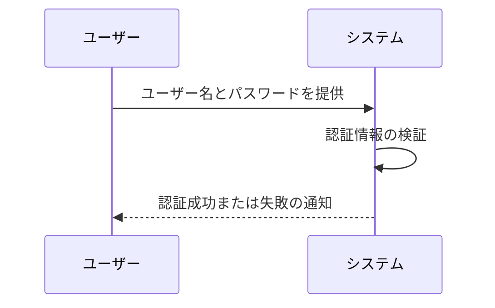
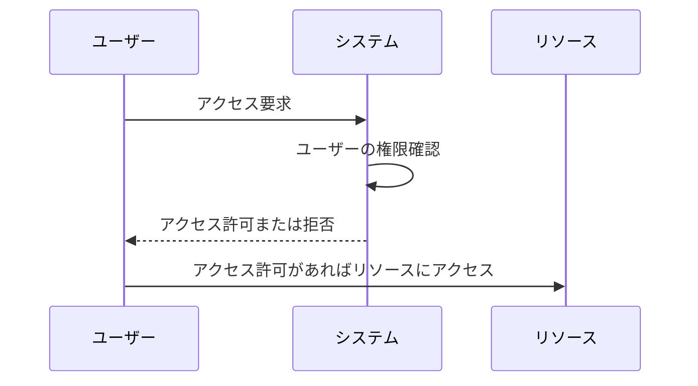
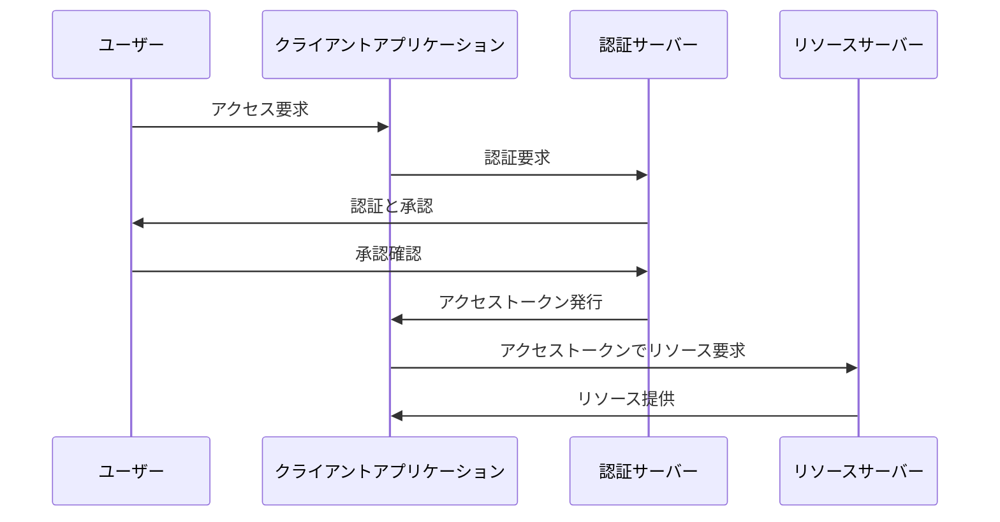
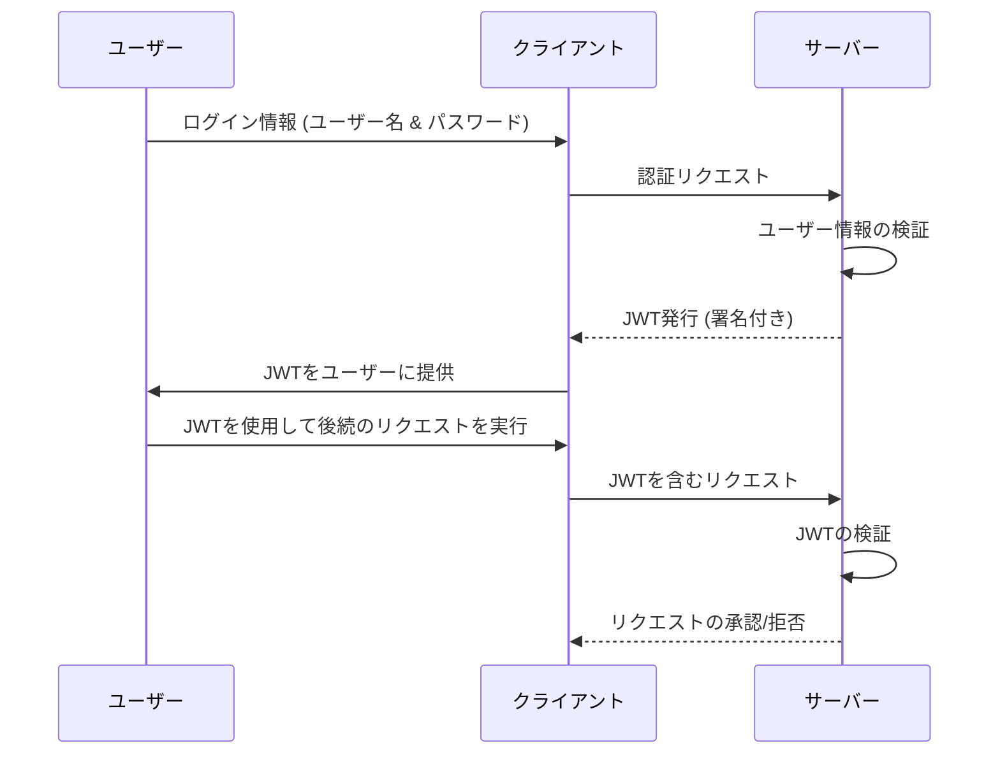
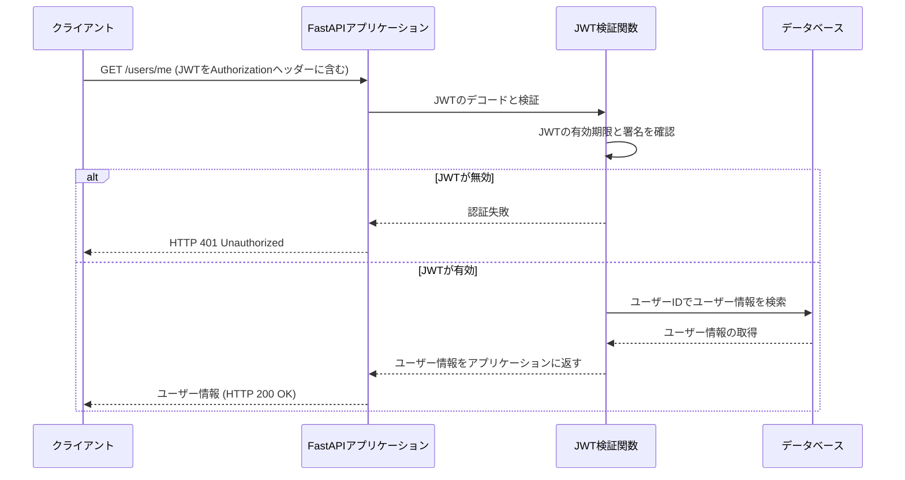
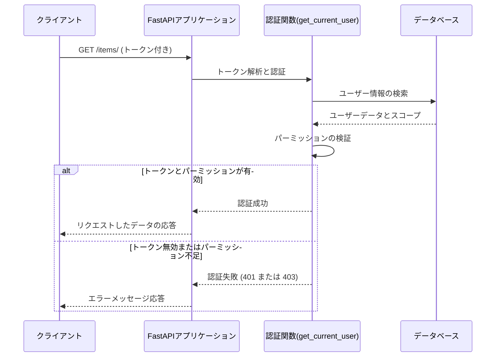

# APIの認証と認可の基礎

<!-- このページでは、APIにおける認証と認可の基本について解説します。認証と認可の違いとその重要性、そして実装方法について学びます。 -->

---

# 講義のアジェンダ

- 認証とは？
- 認可とは？
- 主要な認証技術
- OAuthの詳細
- 主要な認可技術
- APIセキュリティのベストプラクティス
- FastAPIにおける認証認可の実装
- トークンの有効期限の設定
- Q&A

---

# 認証とは？

- **定義**: ユーザーが自分の身元を証明するプロセス。
- **目的**: システムが正しいユーザーと通信していることを保証。
- **方法**:
  - パスワード
  - バイオメトリクス
  - 二要素認証

<!-- スピーカーノート:
このセクションでは認証の基本的な定義と目的について説明します。認証は、ユーザーが自分の身元を証明するプロセスです。これは、システムが正しいユーザーとのみ通信を行うために不可欠です。パスワード、バイオメトリクス、二要素認証など、さまざまな方法を用いてこのプロセスを実施することができます。認証の強化は、不正アクセスからシステムを保護する上で重要な役割を果たします。-->

---

# 認証処理 - 処理フロー



---

# 認可とは？

- **定義**: 認証済みのユーザーが特定のリソースにアクセスできるかを決定するプロセス。
- **目的**: リソースへのアクセスを適切に制限することにより、セキュリティを保持。
- **方法**:
  - アクセス制御リスト (ACL)
  - ロールベースアクセス制御 (RBAC)
  - 属性ベースアクセス制御 (ABAC)

<!-- このスライドでは認可の基本的な概念を紹介します。認可は適切なユーザーが正しいリソースにアクセスできるようにするための重要なセキュリティ対策です。 -->

---

# 認可処理 - 処理フロー


---

# 主要な認証技術

- **技術**:
  - パスワードベース認証
  - 二要素認証
  - デジタル証明書
  - バイオメトリック認証

<!-- このスライドでは、現代の認証技術とその特徴について詳しく解説します。 -->

---

# パスワードベース認証

- **概要**: 最も一般的な認証形式で、ユーザーは事前に登録したパスワードを使用して自身を認証。
- **セキュリティ対策**:
  - 強力なパスワードポリシー
  - パスワードの定期的な更新
  - パスワードのハッシュ化

<!-- スピーカーノート:
パスワードベースの認証は、そのシンプルさから広く採用されていますが、セキュリティ面での課題も伴います。このスライドでは、セキュアなパスワード管理の重要性、強力なパスワードポリシーの定義、パスワードの定期的な変更、そしてパスワードハッシュ化の技術を説明します。これらの措置によって、パスワードが漏洩した際のリスクを軽減し、全体的なセキュリティを向上させることができます。-->

---

# 二要素認証

- **概要**: 二要素認証は、パスワードに加えて、何かユーザーが持っているもの（トークン、スマートフォンアプリ）を利用します。
- **利点**:
  - セキュリティの向上
  - 盗難やなりすましに対する保護

<!-- スピーカーノート:
二要素認証は、セキュリティの層を増やすことにより、単一の認証要素だけでは不十分な場合のリスクを減少します。このスライドでは、何故二要素認証が現代のセキュリティ戦略に不可欠なのか、そしてそれがどのようにして盗難やアカウントの乗っ取りから保護するかを説明します。特に、物理的なトークンやスマートフォンを使用することで、不正アクセスの障壁を大きく高めることができます。-->

---

# デジタル証明書

- **概要**: デジタル証明書を用いた認証は、公開鍵インフラストラクチャ（PKI）に基づいて、ユーザーの身元を確認します。
- **利点**:
  - 身元の信頼性の確保
  - セキュリティの非常に高いレベルの提供

<!-- スピーカーノート:
デジタル証明書は、公開鍵と秘密鍵のペアを利用してユーザーの身元を確認する高度な認証手法です。このスライドでは、PKIの基本的な構造と、どのようにしてデジタル証明書が身元の信頼性を確保し、通信のセキュリティを高めるかについて解説します。デジタル証明書は特に、企業や政府機関など、高度なセキュリティが求められる環境で重要です。-->

---

# バイオメトリック認証

- **概要**: 生体認証は、指紋、虹彩、顔認識など、ユーザー固有の生体情報を用いて認証を行います。
- **利点**:
  - 偽造や盗難が困難
  - ユーザーフレンドリー

<!-- スピーカーノート:
生体認証技術は、そのユニークな利点により急速に普及しています。このスライドでは、生体認証がどのようにしてユーザー固有の特徴を利用するか、またそれがどのようにセキュリティを向上させるかを詳細に説明します。特に、生体情報の偽造や盗難が非常に困難であるため、セキュリティが極めて高く、使いやすい認証方法とされています。-->

---

# OAuthの詳細

- **概要**: サードパーティアプリケーションがユーザーの代わりにサーバーに安全にアクセスするためのオープンスタンダード。
- **利用シナリオ**: ソーシャルログイン、アクセス委譲。
- **流れ**:
  - リソースオーナーがアクセス許可を付与。
  - クライアントがアクセストークンを使用してリソースサーバーにアクセス。

<!-- スピーカーノート:
OAuthについて詳しく解説します。OAuthはサードパーティアプリケーションがユーザーの許可を得て安全にリソースにアクセスするためのオープンスタンダードです。主な利用シナリオには、ソーシャルログインやアクセス委譲があります。このプロトコルは、ユーザーのログイン情報を第三者に露出させることなく、特定のリソースへのアクセス権を委譲することを可能にします。これにより、ユーザーはセキュリティを維持しつつ、複数のサービスを簡単に利用できるようになります。-->

---

# OAuthの基本概念

- **目的**: サードパーティのアプリケーションがユーザーの許可を得て、安全にリソースへのアクセスを行うことを可能にする。
- **利点**:
  - ユーザーのログイン情報がサードパーティに露出しない。
  - アクセス権を細かくコントロールし、必要なリソースのみに限定可能。

<!-- このスライドでは、OAuthが解決する問題とその目的について説明します。 -->

---

# OAuthの処理フロー



<!-- スピーカーノート:
このスライドでは、OAuthの処理フローを具体的に解説します。このフローは、ユーザーがクライアントアプリケーションを通じてリソースサーバーのリソースにアクセスするための認証と承認のプロセスを示しています。
1. **アクセス要求**: ユーザーがクライアントアプリケーションにリソースへのアクセスを要求します。
2. **認証要求**: クライアントアプリケーションが認証サーバーに対して認証を要求します。この段階で、ユーザーはまだ認証されていません。
3. **認証と承認**: 認証サーバーがユーザーに対して認証を求め、リソースへのアクセスを承認するかどうかを尋ねます。
4. **承認確認**: ユーザーがアクセスを承認すると、認証サーバーはこの情報を受け取ります。
5. **アクセストークン発行**: 認証サーバーは、クライアントアプリケーションに対してアクセストークンを発行します。このトークンはリソースサーバーへのアクセス権をクライアントに与えます。
6. **アクセストークンでリソース要求**: クライアントアプリケーションはこのアクセストークンを使用してリソースサーバーにアクセスを要求します。
7. **リソース提供**: リソースサーバーはアクセストークンを検証し、適切であればリクエストされたリソースをクライアントアプリケーションに提供します。
このプロセスにより、ユーザーのデータは保護され、サードパーティアプリケーションが安全にリソースにアクセスできるようになります。-->

---

# FastAPIでのOAuthの実装

```python
from fastapi import FastAPI, Depends, HTTPException, status
from fastapi.security import OAuth2PasswordBearer, OAuth2PasswordRequestForm

app = FastAPI()
oauth2_scheme = OAuth2PasswordBearer(tokenUrl="token")

def fake_decode_token(token: str):
    return {"username": "user1"} if token == "secret" else None
async def get_current_user(token: str = Depends(oauth2_scheme)):
    user = fake_decode_token(token)
    if not user:
        raise HTTPException(
            status_code=status.HTTP_401_UNAUTHORIZED,
            detail="Invalid authentication credentials",
            headers={"WWW-Authenticate": "Bearer"},
        )
    return user
@app.post("/token")
async def login(form_data: OAuth2PasswordRequestForm = Depends()):
    return {"access_token": form_data.username, "token_type": "bearer"}
@app.get("/users/me")
async def read_users_me(current_user: dict = Depends(get_current_user)):
    return current_user
```
---

# OAuthのセキュリティ上の考慮事項

- トークンの安全な保管: アクセストークンは機密情報であり、安全に保管する必要があります。
- 有効期限の設定: トークンには適切な有効期限を設け、期限切れ後に再認証を要求することが重要です。
- スコープの限定: トークンによるアクセスは、必要最小限のリソースに限定するべきです。

<!-- スピーカーノート:
このスライドでは、OAuthを用いた認証プロセスにおいて考慮すべきセキュリティ対策について詳しく説明します。これには以下の重要なポイントが含まれます。

1. **トークンの安全な保管**: アクセストークンはユーザーの認証情報を代表する重要なデータであり、攻撃者にとって魅力的なターゲットです。このため、トークンは暗号化された形式で安全な場所に保管する必要があります。また、クライアントサイドでのトークン保管は、安全なストレージを使用して行うべきです。

2. **有効期限の設定**: アクセストークンに短めの有効期限を設定し、期限が切れた後にはユーザーが再認証を行う必要があるようにすることで、万一トークンが漏洩してもその影響を限定することができます。リフレッシュトークンは長めに設定することが一般的ですが、これも安全な環境下で管理する必要があります。

3. **スコープの限定**: トークンには、その使用が許可される具体的なスコープ（アクセス範囲）を設定します。これにより、トークンが不正に使用された場合のリスクを最小限に抑えることができます。たとえば、ユーザーがSNSの写真にのみアクセスすることを許可するトークンには、その他の個人情報にアクセスする権限を与えないようにします。

これらの措置は、OAuthを使用したシステムのセキュリティを向上させるために非常に重要です。適切に実施することで、データの不正アクセスを防ぎ、ユーザーの信頼を維持することが可能になります。-->

---

# 主要な認可技術

- **技術**:
  - アクセス制御リスト (ACL)
  - ロールベースアクセス制御 (RBAC)
  - 属性ベースアクセス制御 (ABAC)
  - ポリシーベースアクセス管理 (PBAC)

<!-- このスライドでは、様々な認可技術とその適用例について解説します。 -->

---

# アクセス制御リスト (ACL)

- **概要**: アクセス制御リストは、ユーザーやグループがリソースに対して持つ権限を明確に定義します。
- **利点**:
  - 単純で理解しやすい
  - リソースごとに細かいアクセス制御が可能

<!-- スピーカーノート:
ACLは、ファイルシステムやネットワークリソースにアクセスする権限を個別に設定するための非常に基本的で強力なツールです。このスライドでは、ACLがどのようにして個々のユーザーやグループに特定のリソースへのアクセス権を与えるか、またそれがシステムのセキュリティをどのように強化するかを説明します。特に、ACLを使用することで、不必要なアクセスからリソースを保護し、セキュリティ違反のリスクを最小限に抑えることができます。-->

---

# ロールベースアクセス制御 (RBAC)

- **概要**: RBACでは、ユーザーの役割に基づいてアクセス権限を付与します。
- **利点**:
  - 役割ごとに権限を管理することで、大規模な組織でも効率的に権限設定が可能
  - セキュリティポリシーの一貫性と維持が容易

<!-- スピーカーノート:
RBACは、特定の役割を持つユーザーにのみ特定のリソースへのアクセスを許可する方法です。このアプローチは、組織のセキュリティポリシーの管理を簡素化し、運用の効率を高めることができます。このスライドでは、RBACの実装方法、利点、および組織における役割の定義の重要性について詳しく説明します。役割に基づくアクセス制御を適切に管理することで、不正アクセスのリスクを減らしつつ、必要なユーザーには適切なリソースへのアクセスを保証できます。-->

---

# 属性ベースアクセス制御 (ABAC)

- **概要**: ABACは、ユーザーの属性（例: 部署、役職等）に基づいてアクセスを制御します。
- **利点**:
  - 非常に柔軟なアクセス制御が可能
  - ポリシーに基づいて自動的に権限を調整

<!-- スピーカーノート:
ABACは、ユーザーの属性を基にアクセスを動的に制御する高度な方法です。このスライドでは、ABACがどのようにして組織のポリシーや環境の変化に応じてアクセス権を自動調整するかを説明します。ABACの利用により、非常に複雑なセキュリティ要件を持つ環境でも、個々のユーザーのニーズとセキュリティ要件のバランスを取ることが可能です。この柔軟性は、現代の多様なビジネス環境において特に価値があります。-->

---

# ポリシーベースアクセス管理 (PBAC)

- **概要**: PBACは、セキュリティポリシーに基づいてアクセスを制御します。これは、組織のポリシーに沿って自動的にアクセス権限を付与または拒否します。
- **利点**:
  - 複数のリソースやアプリケーションにわたって一貫したアクセスポリシーを適用
  - 変更に対して高い柔軟性と適応性

<!-- スピーカーノート:
PBACは、組織全体のポリシーに基づいてアクセスを制御する方法です。このスライドでは、PBACがどのようにしてセキュリティポリシーを自動的に適用し、組織のセキュリティを維持しながら変更に対応するかを説明します。PBACの利用により、大規模な環境でも一貫したセキュリティ管理を行うことができ、新しいアプリケーションやサービスへの迅速な適応が可能となります。-->

---

# APIセキュリティのベストプラクティス

- **ベストプラクティス**:
  - すべての通信にHTTPSを使用する。
  - 適切なトークン管理と有効期限の設定。
  - 定期的なセキュリティ監査と脆弱性評価。

<!-- スピーカーノート:
ここでは、APIセキュリティを強化するためのベストプラクティスに焦点を当てます。すべての通信にHTTPSを使用し、適切なトークン管理と有効期限の設定を行うことが推奨されます。さらに、定期的なセキュリティ監査と脆弱性評価を実施することで、潜在的な脆弱性を早期に発見し対応することが可能です。これらの措置は、APIを保護し、ユーザーのデータを安全に保つために不可欠です。-->

---

# HTTPSの使用

- **重要性**: HTTPSは、データを暗号化することで通信をセキュアにします。
- **利点**:
  - データの盗聴防止
  - データの改ざん防止
  - 身元の確認

<!-- スピーカーノート:
HTTPSは、インターネット上でのデータ送信のセキュリティを確保するための基本的なプロトコルです。このスライドでは、HTTPSがどのようにデータの暗号化を行い、通信のプライバシーと完整性を保ち、最終的にはエンドユーザーのセキュリティを強化するかについて説明します。HTTPSは、特に公開APIやセンシティブな情報を扱うアプリケーションにとって不可欠です。サイバー攻撃者による中間者攻撃（MITM）からユーザーを守るために、すべてのAPI通信にHTTPSを使用することが推奨されます。-->

---

# トークン管理と有効期限の設定

- **概要**: トークンは認証情報として機能し、適切な管理が必要です。
- **ベストプラクティス**:
  - トークンの安全な保管
  - アクセストークンに短い有効期限を設定
  - リフレッシュトークンを利用してアクセスの延長を管理

<!-- スピーカーノート:
トークンは認証プロセスの中核をなす要素であり、その安全な管理はシステム全体のセキュリティに直接影響を与えます。このスライドでは、トークンを安全に保管する方法（例えば、暗号化されたデータベース内や安全なトークンストレージソリューションの使用）、アクセストークンの有効期限を短く設定する理由、およびリフレッシュトークンを使用してユーザーセッションを効果的に管理する方法について詳しく説明します。これにより、セキュリティ侵害のリスクを最小限に抑えつつ、ユーザーエクスペリエンスを最適化できます。-->

---

# 定期的なセキュリティ監査

- **目的**: 定期的なセキュリティ監査により、脆弱性を早期に発見し対処します。
- **方法**:
  - 自動化されたセキュリティスキャンの実施
  - 専門家によるペネトレーションテスト
  - コードレビューとアップデート

<!-- スピーカーノート:
セキュリティ監査は、組織の防御体制を評価し、強化するために不可欠です。このスライドでは、定期的なセキュリティ監査の重要性とその実施方法について説明します。自動化されたツールを使用したセキュリティスキャンは脆弱性を迅速に特定するのに有効ですが、専門家によるペネトレーションテストも併せて行うことで、さらに深い洞察を得ることができます。コードレビューは開発プロセスの早い段階でセキュリティを組み込むための重要な手段です。-->

---

# 脆弱性評価

- **重要性**: 脆弱性評価は、APIのセキュリティ体制を継続的に強化するために不可欠です。
- **ベストプラクティス**:
  - 定期的な脆弱性スキャンの実施
  - セキュリティインシデントに迅速に対応
  - 開発初期からのセキュリティ組み込み

<!-- スピーカーノート:
脆弱性評価は、APIとその周辺のインフラストラクチャのセキュリティを保証する上での重要なプロセスです。このスライドでは、脆弱性評価のプロセス、実施すべきベストプラクティス、およびセキュリティインシデントに迅速に対応するための準備について説明します。定期的な脆弱性スキャンを通じて識別されたリスクを早期に対処することで、組織は重大なデータ侵害や他のセキュリティ問題を防ぐことができます。-->

---

# FastAPIにおける認証認可の実装

- JWTによる認証
- パーミッションベース認可
- セキュリティのベストプラクティス

<!-- このスライドでは、本日の講義でカバーする各トピックの概要を紹介します。このセッションを通じて、FastAPIでの認証認可システムの構築に必要な知識とスキルを身につけることができます。 -->

---

# JWTによる認証

- **JWT (JSON Web Tokens)**: セキュアな情報交換のためのコンパクトでURLセーフな方法。
- **利点**:
  - スケーラビリティ: サーバー側でセッションを保持する必要がない。
  - 柔軟性: 複数のシステム間での利用が容易。
  - 自己完結性: 必要な全ての情報をトークン自体に保持。

---

# JWTによる認証 - 処理フロー



<!-- このスライドでは、JWTがどのように機能するか、そしてそれを使ってユーザー認証をどのように実行するかを説明します。具体的なコード例や実装の詳細は、次のスライドで取り上げます。 -->

---

# JWTの構造

- **JWTは三つの部分から構成されます**:
  - **ヘッダー (Header)**: トークンのタイプと使用されているハッシュアルゴリズムを指定。
  - **ペイロード (Payload)**: トークンに含まれるクレーム（ユーザー情報や有効期限など）。
  - **署名 (Signature)**: トークンが改ざんされていないことを保証。

```json
{
  "alg": "HS256",
  "typ": "JWT"
}
{
  "sub": "1234567890",
  "name": "John Doe",
  "iat": 1516239022
}
HMACSHA256(
  base64UrlEncode(header) + "." +
  base64UrlEncode(payload),
  your-256-bit-secret
)
```
<!-- スピーカーノート:
このスライドでは、JWTの構造について説明しています。ヘッダー部分には、トークンのタイプとして'JWT'が明示されており、使用されるハッシュアルゴリズムとして'HS256'が指定されています。ペイロード部分には、ユーザー識別子'sub'、ユーザー名'name'、トークンが発行された時刻'iat'が含まれています。これらの情報は、トークンの使用者とその有効性を識別するのに使われます。最後に、署名部分はヘッダーとペイロードの情報を秘密鍵と組み合わせて暗号化し、トークンの真正性と改ざん防止を保証します。この署名プロセスにより、受け取ったJWTが信頼できるかどうかをシステムが検証できます。
-->

---

# FastAPI+JWTによる認証の実装

<div>
    <iframe width="100%" height="400" src="https://gist.github.com/ymzkryo/40ebbdb61a19b6b379db1a96b64c44d3.pibb"></iframe>
</div>

---

## JWTの秘密鍵とアルゴリズムの設定

```python
# JWTの秘密鍵
SECRET_KEY = "your_secret_key"
ALGORITHM = "HS256"

oauth2_scheme = OAuth2PasswordBearer(tokenUrl="token")

```
<!-- スピーカーノート:
このコードでは、JWT認証のための基本的な設定を行っています。SECRET_KEYはトークンを署名する際に使用される秘密鍵で、安全に保管する必要があります。ALGORITHMはトークンの署名に使用されるアルゴリズムを指定しており、ここではHS256を使用しています。oauth2_schemeは認証データが含まれるトークンを提供するためのエンドポイントのURLを指定します。
-->


---

## User情報を格納するためのモデル

```python
class User(BaseModel):
    username: str
    password: str


# データベース代わりのユーザーデータ
fake_user_db = {"user1": {"username": "user1", "password": "secret"}}
```

<!-- スピーカーノート:
このコードブロックでは、ユーザー情報を格納するためのPydanticモデルを定義しています。Userクラスはユーザー名とパスワードを属性として持ちます。fake_user_dbはデモ用のデータベース代わりで、実際のユーザーデータを格納しています。これにより、認証プロセス中にユーザー情報の検証が可能になります。
-->

---

## ユーザー認証のための関数

```python
def authenticate_user(fake_db, username: str, password: str):
    user = fake_db.get(username)
    if not user or user['password'] != password:
        return False
    return user
```

<!-- スピーカーノート:
authenticate_user関数は、提供されたユーザー名とパスワードをデータベースと照合して、ユーザーを認証します。この関数は、ユーザー名とパスワードが一致するユーザーを返すか、一致しない場合はFalseを返します。これは認証の中核をなす機能で、セキュリティの実装において重要な役割を果たします。
-->

---

## JWTトークンの生成

```python
# JWTを生成する関数
def create_access_token(data: dict, expires_delta: Optional[timedelta] = None):
    to_encode = data.copy()
    if expires_delta:
        expire = datetime.utcnow() + expires_delta
    else:
        expire = datetime.utcnow() + timedelta(minutes=15)
    to_encode.update({"exp": expire})
    encoded_jwt = jwt.encode(to_encode, SECRET_KEY, algorithm=ALGORITHM)
    return encoded_jwt
```

<!-- スピーカーノート:
create_access_token関数は、認証済みのユーザーデータと有効期限を基にJWTを生成します。このトークンは、ユーザーがAPIに対して後続のリクエストを行う際に認証情報として使用されます。関数内でJWTの有効期限を設定し、トークンを生成しています。これにより、トークンが一定時間後に自動的に失効するようになります。
-->

---

## トークンエンドポイント

```python
# トークンエンドポイント
@app.post("/token")
async def login_for_access_token(form_data: OAuth2PasswordRequestForm = Depends()):
    user = authenticate_user(fake_user_db, form_data.username, form_data.password)
    if not user:
        raise HTTPException(
            status_code=status.HTTP_401_UNAUTHORIZED,
            detail="Incorrect username or password",
            headers={
                "WWW-Authenticate": "Bearer"
            },
        )
        access_token_expires = timedelta(minutes=30)
        access_token = create_access_token(
            data={"sub": user['username']}, expires_delta=access_token_expires
        )
        return {"access_token": access_token, "token_type": "bearer"}
```

<!-- スピーカーノート:
/login_for_access_token関数は、ユーザーがログインフォームから提供した認証データを使用してJWTを発行します。このエンドポイントは、ユーザー名とパスワードが正しい場合にアクセストークンを返し、そうでない場合には認証エラーを返します。これにより、認証のセキュリティが保たれます。
-->

---

## ユーザ情報の取得

```python
# 依存性のあるユーザを取得
async def get_current_user(token: str = Depends(oauth2_scheme)):
    try:
        payload = jwt.decode(token, SECRET_KEY, algorithms=[ALGORITHM])
        username: str = payload.get("sub")
        if username is None:
            raise HTTPException(
                status_code=status.HTTP_401_UNAUTHORIZED,
                detail="Could not validate credentials",
                headers={"WWW-Authenticate": "Bearer"},
            )
            user = fake_user_db.get(username)
            if user is None:
                raise HTTPException(
                    status_code=status.HTTP_401_UNAUTHORIZED,
                    detail="Could not validate credentials",
                    headers={"WWW-Authenticate": "Bearer"},
                )
    except JWTError:
        raise HTTPException(
            status_code=status.HTTP_401_UNAUTHORIZED,
            detail="Could not validate credentials",
            headers={"WWW-Authenticate": "Bearer"},
        )
    return user
```

<!-- スピーカーノート:
get_current_user関数は、提供されたJWTを検証し、トークンに含まれるユーザー情報をデコードして返します。トークンが有効であれば、関連するユーザーデータが返され、無効であれば認証エラーが返されます。この関数は、ユーザーがAPIの保護されたリソースにアクセスする
-->

---

## ユーザ情報取得エンドポイント

```python
@app.get("/users/me")
async def read_users_me(current_user: User = Depends(get_current_user)):
    return current_user
```

<!-- スピーカーノート:
/read_users_me関数は、認証されたユーザーの情報を返すエンドポイントです。この関数は、get_current_user関数を通じて提供されたユーザー情報に基づいて、その情報をクライアントに返します。このエンドポイントは、ユーザーが自身の情報を確認するために使用されます。
-->


---

# FastAPI+JWTによる認証の実装 - 処理フロー


<!--このフローチャートでは、クライアントが /users/me エンドポイントをGETリクエストする際の認証フローを示しています。クライアントはJWTをAuthorizationヘッダーに含めてリクエストを送信し、アプリケーションはこのJWTを検証します。JWTが有効であれば、関連するユーザー情報がデータベースから取得され、クライアントに返されます。JWTが無効な場合は、認証エラーとしてHTTP 401ステータスが返されます。このプロセスを理解することは、セキュアなAPIを設計する上で非常に重要です。-->


---

# パーミッションベース認可

- **概要**: パーミッションベース認可は、特定のアクションを実行するためのユーザーの権限を管理する方法です。
- **目的**: システムリソースへのアクセスを適切に制御し、セキュリティを保ちながら操作の柔軟性を提供する。
- **実装方法**:
  - ユーザーにパーミッションを割り当てる。
  - 各APIエンドポイントに対するパーミッションチェックを実行。

<!-- スピーカーノート:
このスライドでは、パーミッションベース認可の概要とその実装方法について説明します。パーミッションベース認可を使用することで、アプリケーションのセキュリティを強化し、ユーザーが必要なリソースにのみアクセスできるように管理します。
-->

---

# パーミッションベース認可の実装

```python
from fastapi import fastapi, depends, httpexception, security
from fastapi.security import oauth2passwordbearer, securityscopes

app = fastapi()
oauth2_scheme = oauth2passwordbearer(tokenurl="token", scopes={"items": "read items"})

def get_current_user(security_scopes: securityscopes, token: str = depends(oauth2_scheme)):
    if token != "secret_token":
        raise httpexception(status_code=401, detail="invalid token")
    user_scopes = token_to_scopes(token)  # 仮の関数を想定
    if security_scopes.scopes not in user_scopes:
        raise httpexception(status_code=403, detail="not enough permissions")
    return {"username": "johndoe", "scopes": user_scopes}

@app.get("/items/", dependencies=[depends(get_current_user)])
async def read_items():
    return [{"item": "foo"}, {"item": "bar"}]
```

<!-- スピーカーノート:
このコードはFastAPIを使用してパーミッションベースの認可を実装する方法を示しています。
1. **OAuth2PasswordBearer**: これは認証スキームを設定するためのヘルパークラスです。`tokenUrl`はトークンが取得できるURLを指定します。ここでは、特定のスコープを持つトークンを要求する設定も行います。
2. **get_current_user 関数**: この関数はセキュリティスコープとトークンを引数に取り、トークンが有効かつ適切なパーミッションを持っているかを検証します。トークンが無効な場合や、要求されたスコープを持たない場合には適切なHTTPエラーを返します。
3. **read_items エンドポイント**: このエンドポイントは、依存関係として`get_current_user`を使用しており、認可が通らなければアクセスできません。認可が成功すれば、アイテムのリストを返します。

この実装により、APIエンドポイントへのアクセスに必要な認可処理を効率的かつ効果的に管理できます。
-->

---

# パーミッションベース認可の実装 - 処理フロー



<!-- スピーカーノート:
このフローチャートは、FastAPIを用いたパーミッションベース認可の処理の流れを示しています。クライアントからのリクエストは、トークンを添えて`/items/`エンドポイントに送信されます。FastAPIアプリケーションはこのトークンを`get_current_user`関数に渡し、ユーザー認証と認可の検証が行われます。この関数はデータベースからユーザーデータを取得し、提供されたトークンに基づいてユーザーのスコープを検証します。トークンが有効であり、かつ必要なスコープをユーザーが持っていれば、リクエストは成功しデータが返されます。トークンが無効であるか、または必要なパーミッションがない場合には、適切なHTTPステータスコードとエラーメッセージが返されます。この処理により、APIは適切に保護され、ユーザーに適切なアクセスのみが許可されます。
-->

---

# トークンの有効期限の設定

- トークンの有効期限とは？
- トークンの種類ごとの推奨有効期間
- 有効期限の設定戦略

<!-- スピーカーノート:
トークンの有効期限設定は、セキュリティとユーザーエクスペリエンスのバランスを取るために非常に重要です。このスライドでは、アクセストークンとリフレッシュトークンの推奨有効期間を紹介します。アクセストークンは短期間、リフレッシュトークンは長期間設定されることが一般的です。適切な期間を設定することで、セキュリティを維持しつつ、ユーザーが頻繁に認証を求められることなくサービスを利用できるようになります。-->
---

# トークンの有効期限とは？

- **定義**: トークンの有効期限は、トークンが発行されてからそのセキュリティ認証が有効である期間を指します。
- **重要性**: 有効期限はセキュリティを確保しつつ、ユーザー体験を維持するために重要です。

<!-- スピーカーノート:
トークンの有効期限は、APIセキュリティの基本的な構成要素です。有効期限を設定することで、トークンが不正に使用されるリスクを時間的に制限し、システムの全体的なセキュリティを向上させることができます。 -->

---

# トークンの種類ごとの推奨有効期間

- **アクセストークン**: 通常、数分から数時間。
  - 短期間での期限切れは、万が一トークンが漏洩した場合の損害を限定します。
- **リフレッシュトークン**: 数日から数ヶ月。
  - 長期間有効であり、ユーザーが頻繁にログインする必要を減らすことができます。

<!-- スピーカーノート:
アクセストークンとリフレッシュトークンは異なる目的で使用されます。アクセストークンは短期間で頻繁に更新されることが望ましいですが、リフレッシュトークンはより長い期間有効で、ユーザーが新しいアクセストークンを簡単に取得できるようにするために使用されます。これにより、ユーザーエクスペリエンスとセキュリティのバランスを取ることが可能になります。 -->

---

# 有効期限の設定戦略

- **セキュリティと利便性のバランス**: 有効期限はセキュリティの厳しさとユーザーの利便性の間のバランスをとる必要があります。
- **環境に応じた調整**: トークンの有効期限は、使用される環境やアプリケーションの性質によって調整されるべきです。

<!-- スピーカーノート:
有効期限の設定は、攻撃者に利用される窓口を最小化するために重要です。セキュリティが最優先されるべき環境では、より短い有効期限を設定することが推奨されます。一方で、ユーザーが頻繁にログインを強いられることなくサービスをスムーズに利用できるように、適切な長さの有効期限が設定されるべきです。 -->

---

# ケーススタディ: トークンの有効期限設定

## アクセストークンとリフレッシュトークンの適用例

### 例1: Eコマースアプリケーション

- **状況**: 高頻度でセキュリティが要求される取引を扱う。
- **アクセストークン**: 15分の有効期限。
  - 頻繁な取引更新に対応し、セキュリティを最大化。
  - **リフレッシュトークン**: 7日の有効期限。
    - ユーザーが頻繁にログインしなくても購買活動がスムーズに行えるようにする。

### 例2: ソーシャルメディアプラットフォーム

- **状況**: ユーザーが長時間オンラインで活動する環境。
- **アクセストークン**: 1時間の有効期限。
  - ユーザー体験を損なわずに適度なセキュリティを保持。
  - **リフレッシュトークン**: 30日の有効期限。
    - ロングセッションをサポートし、ユーザーが頻繁に認証を求められるのを防ぐ。

    <!-- スピーカーノート:
    このスライドでは、異なるタイプのアプリケーションにおけるトークンの有効期限設定の実例を紹介します。Eコマースアプリケーションではセキュリティが非常に重要であるため、アクセストークンの有効期限を短く設定しています。一方、ソーシャルメディアプラットフォームではユーザーが長時間アクセスすることが多いため、より長い有効期限を設定しています。これらの例から、アプリケーションの性質に応じてトークンの有効期限を適切に設定することの重要性を学びます。 -->

---

# Q&A

## 質疑応答のセッション

---

# 参考資料

- [OAuth 2 in Action (https://amzn.to/3vVPQcQ)
- [Identity and Data Security for Web Development: Best Practices](https://amzn.to/49KkZxw)
- [Mastering OAuth 2.0](https://amzn.to/442Xe2C)
- [OAuth徹底入門 セキュアな認可システムを適用するための原則と実践](https://amzn.to/4d5Wde8)
- [Software Design (ソフトウェアデザイン) 2020年11月号 [雑誌](https://amzn.to/447QBvO)
